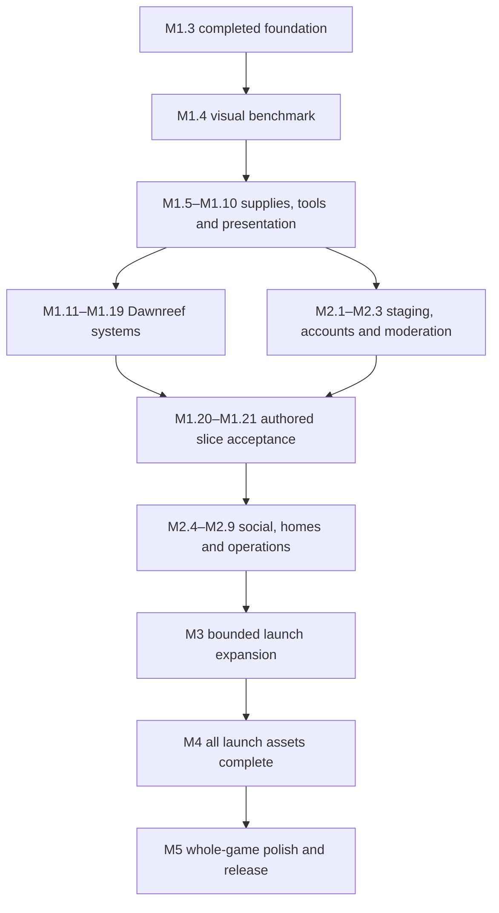

# Veilbound Tides — roadmap

Revised 2026-09-10 after inspecting the repository at
3ac1f8fc69379b15594191294e6248e9911be950, canonical docs, draft
[PR #4](https://github.com/Fineyew/GameTesting/pull/4), source, retained Dawnreef render
and successful M0–M1.3 CI jobs. Roadmap checkpoint edec97b changed planning only.
The owner subsequently authorized implementation; current evidence lives in PROJECT_STATE.

**Current engineering milestone: M1.5, usable Sunthread Bandages (in progress).**
On 2026-09-11 the owner requested full continuation after the device-gate handoff.
Proceed with engineering checkpoints while recording M1.4/M1.5 physical acceptance as
outstanding. This changes development ordering only; Device E/R/L evidence and final
release acceptance requirements are preserved. Do not infer phone/art acceptance from CI. The former
unstarted M1.4 bandage recommendation moved to M1.5 with its scope preserved. The dated
roadmap amendment governs forward ordering; earlier handoff recommendations remain history.

## How to use this roadmap

- Completed milestones and their evidence below are immutable history. Beyond the current
  M1.4/M1.5 candidates, forward milestones are **planned**, including existing catalog examples.
- Android is the primary game. Keep Godot 4.5.1 Compatibility, the modular client,
  FastAPI/PostgreSQL/JSON ports, server-owned rules and existing IDs/saves/tests. A future
  change to those decisions needs measured justification and a compatibility plan.
- Work on one bounded milestone at a time. Independent work can advance when a dependency
  is blocked, but do not mark the blocked milestone complete. Never turn a tool, device,
  account or art-production limitation into an invented pass.
- Each milestone ends with implementation inspection, applicable tests, a playable review
  where relevant, exact source/evidence provenance and a durable Git checkpoint. Update
  canonical state at implementation handoffs. No wall-clock delivery promises are implied.
- Review visible progress every playable milestone. A backend-only checkpoint must enable
  a named player experience; do not grow an open-ended infrastructure backlog ahead of art.
- Author one area, encounter or small content batch at a time. New content must have a
  working acquisition/interaction path, final-quality assets for its accepted scope and
  mobile performance evidence. A JSON definition or attractive screenshot is insufficient.

### What “the entire game is finished” means

The existing authored-slice target is preserved: Dawnreef town plus its adventure area,
18 varied quests, 18 obtainable functioning spells across the first three traditions,
eight recurring NPCs, five regular enemies, a handcrafted dungeon with puzzle/checkpoint/
phased boss, earned equipment and mount, and two gathering/recipe loops. The original
conditional crafting target is scheduled explicitly; it is not a completed feature.

That slice is a quality and production benchmark, not the commercial release. The forward
plan also covers persistent housing, safe social play, trading/guild foundations, side
activities, expansion, account lifecycle, operations and a fully finished presentation.
At M3.1 freeze a bounded version-1 launch inventory. Recommended planning envelope:
Dawnreef and one additional connected adventure region, with their interiors and agreed
activities, rather than an unspecified number of worlds. This is a proposal for that
scope review, not a new region design or an automatic cut of requested long-term features.
The owner approves changes to launch scope before committing production effort or cost.

**Every launch area and player-facing asset must be finished before release.** This
includes all playable regions, distant vistas visible from them, NPCs, enemies, bosses,
character options, equipment appearances, mounts, furniture, props, environments, spell
effects, audio and major UI surfaces. M4 closes the complete launch inventory; M5 checks
the game as one consistent experience. Future regions and systems repeat the same art,
accessibility, performance and release gates. A live MMO can expand indefinitely; unfinished
promised launch work cannot be relabeled post-launch simply to call version 1 complete.

### Milestone kinds and validation notation

| Kind | Meaning |
|---|---|
| Engineering foundation | Shared runtime, authority, persistence and movement capabilities |
| Gameplay systems | Reusable player-facing rules and interactions |
| Content systems | Authoring, validation, asset and content delivery tools |
| Authored content | Playable stories, regions, encounters and rewards using those systems |
| Visual production | Finished models, materials, environments, animation, VFX and UI art |
| Polish | Readability, feel, audio integration, accessibility and consistency |
| Release engineering | Device certification, security, operations, deployment and distribution |

Every milestone below specifies purpose/additions, dependencies, completion, validation
and delivery. Multiple kinds are intentional. Delivery fields mean:

- **APK yes:** produce and retain a fresh ARM64 review build only after required gates
  pass; record version, source SHA, signature and hash. Failed-build diagnostics may be
  retained, but do not publish a failed build as the milestone deliverable.
- **APK no:** tools/docs/server-only checkpoint; validate affected APIs/persistence and
  compatibility with the last accepted client. Do not rebuild Android just for ceremony.
- **P:** expected client/server interface change, including HTTP capabilities, world
  geometry or WebSocket messages. “Additive” still requires negotiation and old-client
  failure behavior. Do not bump protocol numbers merely because a milestone number changed.
- **S:** expected persisted-state/schema change. Optional aggregate fields still require
  old-save tests; choose DDL/normalization only when actual ownership or size requires it.
  Catalog and asset formats are called out separately. No future schema is implemented here.
- **Device E:** actual ARM64 phone install and relevant online touch/camera/readability
  flow required for acceptance. Establish a 20-minute thermal/frame-time/memory baseline
  at M1.4; repeat the sustained trace when the milestone changes rendering, motion or
  resource load materially. For a pure rules/UI change, record the targeted phone result
  and the unchanged performance baseline being reused. The owner's S25 Ultra is useful
  but cannot establish the baseline device tier by itself.
- **Device R:** E plus representative approximately 6 GB Android hardware, measured
  quality presets, crowded/combat views and network/background cases relevant to the feature.
- **Device L:** the agreed release matrix, including baseline and high-tier phones,
  tablet/aspect-ratio coverage, sustained sessions and cold/update/resume/network scenarios.
- **Device no:** no new physical-device gate for that isolated checkpoint. Its player-facing
  integration must still pass the later named device gate. Required physical work remains
  explicitly unverified until real measurements exist; emulator success is not a substitute.

**F** below means the existing full backend/PostgreSQL migrations and regressions, content
bundle validation, Godot import/smoke, actual Godot/API integration, render/draw-call and
Android emulator install/touch/visible-resume gates. Extend them for changed behavior;
retain their assertions. Native QA currently covers preview/navigation; each new online
phone flow needs actual online device evidence as well as the Godot/API automation.
For every authority/state change, test ownership, forgery, malformed inputs, stale commands,
retries after receipt pruning, concurrency, rollback and old JSON/JSONB saves as applicable.
Future gates must exercise actual new paths, not only repeat the original six-spell demo.

### Performance and art rules that apply throughout

Preserve current targets: sustained 30 FPS on representative 6 GB Android hardware,
optional 60 FPS on capable devices; 700 MB working memory and under 1 GB peak; 150 draw
calls typical/250 dense; approximately 150k visible triangles baseline; 128 MB initial
texture budget; base download under 150 MB. Current 89 desktop draw calls and the 27.9 MB
APK are observations, not whole-game/device certification. Measure transparent overdraw,
skinning, particles, shader variants, startup, loading peaks, storage, frame-time percentiles,
battery and thermal degradation as the asset set grows. Record test conditions and traces.
Keep the approximately 15 KB/s per-player network goal and 32-person room cap provisional
until load and real-network measurements justify them. Do not assume 32 players are tested.

Start with the current renderer and cheap materials. Add atlases, LOD, culling, effect
limits and scalable quality settings as measured content needs them; never raise budgets
silently to pass a visual review. A smaller dense, well-composed world is preferable to
unbounded content that cannot run on the target phone. Cost decisions use the existing
roughly 2-vCPU/4-GB server envelope first; no premature microservices or Kubernetes.

M1.4 establishes an approved in-engine reference and a reusable art kit. Every authored
batch then includes a visual pass, motion/sound integration, phone readability check and
comparison against that reference. Track each asset by stable binding, editable source,
provenance/license, import settings, dependencies, budget, placeholder/final status and
review evidence. Automated missing-reference checks supplement human art review.
Prototype primitive models, current gait and generic spell bursts do not become final
merely by changing colors. Procedural authoring tools may remain, but their shipped outputs
must pass the same final-asset criteria. Replace temporary outputs without removing useful
generators, reusable scenes or working gameplay code.

## Preserved completed checkpoints

| Milestone | Code / engineering checkpoint | Documentation handoff |
|---|---|---|
| M0 | Engineering complete at 1044f9542c1c0cda7252aa782f0b6881c5252db6 | Same checkpoint; physical-device status remains separate |
| M1.1 | 4efd3a689d93e2ed2fa31647a2ff67affca67c5e | d1382147f3b88388c461abcb99506c28e3da3771 |
| M1.2 | d0c604894ba768c6647b42ff19a76285d0e41bce | 56370e6dd442485101824dc188d12e00aa87d3f8 |
| M1.3 | de9d7a38bed6c18b396173cfd926c09c20e8159d | 3ac1f8fc69379b15594191294e6248e9911be950 |

The inspection confirmed all jobs successful in M0 run34430377236, M1.1 run34431891977,
M1.2 run34437004626, M1.3 run34440512749 and handoff run34441258244. M1.3 remains the
last implemented gameplay milestone: 90 backend tests/30 subtests including eight real
PostgreSQL tests, plus the client/render/emulator gates. Retained ARM64 0.2.3/code5
artifact10137878626 is unchanged. Physical-phone validation is still unverified.

## M0 — foundation handoff (engineering complete)

- [x] Restore and remotely checkpoint modular client, combat, presence and PostgreSQL adapter.
- [x] Validate real PostgreSQL migrations, persistence and concurrent/retried actions in CI.
- [x] Validate actual Godot client against API and a second connected player.
- [x] Import/movement/UI smoke; static material batching and initial lighting adjustment.
- [x] Reconcile PROJECT_STATE and CHANGELOG with completed CI evidence.
- [x] Fix the observed coastline/floor overlap and inspect fresh renders.
- [x] Automate, retain and signature-check an ARM64 APK; verify Android runtime install/start.
- [x] Verify visible world and touch locomotion after resume (run 34430377236 at 69457a4).
- [x] Record physical Android testing status, performance targets, remaining risks and build provenance.
- [x] Complete canonical documentation and checkpoint M0 source/artifacts remotely.

M0 engineering completion requires a reproducible retained APK, automated checks and
honest device-status documentation. Physical phone thermal/touch/network validation is
an open release gate; never call an emulator or desktop result a physical-phone pass.
No broad M1 content production before this engineering checkpoint.

## M1 — authored vertical slice (M1.3 complete)

- [x] M1.1: catalog-owned NPC dialogue/branches/conditions with server-owned cursors.
- [x] Validated quest offers, ordered defeat/inspect/talk objectives and once-only rewards.
- [x] One Mara follow-up through existing reeds/cistern landmarks; data-driven HUD/journal.
- [x] Preserve old saves/starter IDs; prove API authority, retries, concurrent turn-ins and
  PostgreSQL persistence; real Godot story integration and Android runtime gates pass.

M1.1 code/APK source 4efd3a6 passed all jobs in run 34431891977 (38 tests). M0 remains
checkpointed at 1044f95. No bulk content was produced; the cistern dungeon is still sealed.

**M1.2 complete** — code/APK source d0c6048, all gates passed in run 34437004626.

- [x] Three short Mara lessons make Beacon Trace, Reed Aegis and Seam Lance obtainable.
- [x] Six-slot persistent folio, ownership/catalog/duplicate checks, stale-write/retry guards.
- [x] Prepared-only combat with universal Brace/Gather; active-combat preparation lock.
- [x] Touch Folio panel, costs/effects/source hints, learned/prepared distinction and safe retry UI.
- [x] JSON old-save/retry/authority coverage and Godot folio smoke checks.
- [x] Complete extended Godot/API acquisition, folio and earned-spell combat integration.
- [x] Complete PostgreSQL, render and Android runtime gates (59 tests, 89 draw calls).
- [x] Retain verified ARM64 0.2.2/code 4, reconcile handoff and checkpoint M1.2.

**M1.3 complete** — code/APK de9d7a3, all gates passed in run34440512749.

- [x] Reuse Mara's supply cart and Lanternkeeper Vest; 12-chit purchase, one chest slot, Guard1.
- [x] Atomic server-owned buy/equip/unequip, ownership/price/stack/level validation.
- [x] Persistent commerce revisions/receipts, old JSON/JSONB defaults and concurrency coverage.
- [x] Touch Bag/vendor comparison, feedback/recovery and unchanged visual appearance.
- [x] Full PostgreSQL/Godot/API/render/Android gates: 90 tests /30 subtests, 89 draw calls.
- [x] Fix native input-time panel detachment; retain failure evidence and pass fresh touch QA.
- [x] Retain verified ARM64 0.2.3/code5 (artifact10137878626), reconcile docs/PR and checkpoint.

## Ordering and dependencies from M1.3

The default order is M1.4–M1.10, then the remaining Dawnreef systems/content, then wider
social/lifestyle and launch production. M2.1–M2.3 are deliberately early operational
dependencies: insert staging after M1.12, account lifecycle after M1.16, and moderation
before the M1.21 outside-player review. Their numbering groups responsibilities, not a
requirement to finish every M1 task first. Local authored/visual work need not wait for a
public server. Do not open untrusted testing or free text before their safety gates.

Specific dependency reasons:

- M1.4 can beautify the existing flat playable footprint now. Server movement is planar;
  M1.7 must precede traversable hills/stairs and extended terrain. Decoration cannot grant
  client-only shortcuts or disagree with authoritative geometry/camera collision.
- The M1.6 authoring pipeline precedes bulk production. M1.11 teaches additional combat
  rules through a few encounters before M1.20 fills the slice's spell/enemy roster.
- Party admission/room ownership (M1.14) precede cooperative turn ownership (M1.15), which
  precedes the dungeon's shared checkpoints/rewards (M1.16). These initially stay in one
  application process. Load data, not the word MMO, decides when to split processes.
- Gathering authority precedes crafting consumption. Equipment/loot precede trading.
  Account recovery/moderation precede open communication and outside-player testing.
- Staging, preserved-ID import and restore drills precede any persistence switch with real
  player data. Pack integrity and zone transfer precede shipping additional regions.
- Content and art grow together. M4 is closure of a maintained asset inventory, not the
  first art-production sprint. M5 cannot excuse unfinished content or missing assets.

## M1 forward — Dawnreef becomes a polished authored slice

### M1.4 — Playable Dawnreef visual benchmark

Implementation authorized after roadmap checkpoint edec97b. A compact original kit,
Wayfarer/Mara rigs and Glimmer presentation are integrated as a benchmark candidate.
Code checkpoint `365993ce7e79fc29025ee23d1c77cbf449ad2bfc` passes the full F gates in
run34483308643, with inspected captures and retained ARM64 0.2.4/code6. Owner art review
and Device E are still pending. This is not a completed milestone; PROJECT_STATE owns evidence.

- **Kind / purpose:** Visual production, content systems, polish. Establish the actual
  final art direction in motion, giving the next APK a clear visible improvement.
- **Adds:** One compact Lantern Well–Mara supply-cart area inside existing geometry;
  a small original architecture/prop/foliage kit, authored materials, ground treatment,
  sky/vista and lighting; one representative Wayfarer asset with idle/walk, a distinct
  Mara presentation, one finished Glimmer Spark presentation and the existing HUD styled
  coherently around them. Reuse interactions, palette, scenes and authority.
- **Depends:** M1.3 only. No new region, quest, combat rule or terrain/network redesign.
- **Complete:** A 2–3-minute controllable route and existing vendor/combat flow demonstrate
  the intended quality at gameplay camera distance. Editable assets/import recipes and
  a small asset-status inventory exist. Before/after walkthroughs use the same camera and
  quality preset. Owner art-direction review accepts the benchmark before copying it widely;
  an illustration, one screenshot or a palette-only change does not satisfy this gate.
- **Validate:** F; material/draw-call/texture/triangle checks; camera occlusion, silhouette,
  readable magic and touch targets; real phone thermal baseline. Keep unfinished areas
  and unsampled assets explicitly placeholder. Do not expand scope to finish all Dawnreef here.
- **Delivery:** APK yes; P none; S none, asset bindings/versions only; Device E required.

### M1.5 — Usable Sunthread Bandages

Implemented candidate; full CI/APK pending. PROJECT_STATE owns current evidence.

- **Kind / purpose:** Gameplay systems. Close the already-defined supplies loop.
- **Adds:** Server-owned out-of-combat bandage use, capped Vigor restoration, atomic item
  consumption, exact-command retry, clear before/after Vigor and enabled existing listing.
- **Depends:** M1.4 for visual continuity (engineering continuation authorized above); reuses M1.3 commerce/receipts and the existing item effect.
- **Complete:** Buy with earned chits, use while injured, reconnect and retain correct
  inventory/Vigor. Full-health, missing-item and active-combat requests have explicit rules
  and cannot silently waste supplies. No new consumables, crafting or inventory rewrite.
- **Validate:** F; malformed/forged use, simultaneous use/purchase, stale/retried commands,
  rollback, zero/maximum Vigor and JSON/PostgreSQL persistence. Touch feedback preserves
  the M1.4 visual language and existing Bag navigation.
- **Delivery:** APK yes; P additive item-use capability; S possible additive receipt/revision
  state, old-save compatibility required; Device E required for the online use flow.

### M1.6 — Reusable content and asset authoring workflow

- **Kind / purpose:** Content systems. Make subsequent production maintainable.
- **Adds:** Extend the current catalog CLI and native Godot editor workflow with templates,
  reference/branch diagnostics, encounter preview, scene/NPC/interaction binding and asset
  dependency/status checks. Record editable sources, licenses, scale/pivots, rig/material
  conventions, atlas/LOD settings and deterministic export. Prefer focused editor helpers
  over a separate web CMS or a new parallel source of truth.
- **Depends:** M1.4's measured kit and M1.1–M1.3 content contracts.
- **Complete:** A second small example can be authored, validated, previewed, versioned and
  rolled back without changing gameplay code. Existing definitions round-trip unchanged;
  unsupported handlers and dangling or falsely final asset bindings fail clearly.
- **Validate:** Template/validator regressions, reproducible bundles/imports, isolated
  Godot/API preview and boundary checks. Examples do not grant debug progress in live play.
- **Delivery:** APK no; P none; S none; versioned authoring/asset metadata only; Device no,
  with exported assets evaluated in the next playable milestone.

### M1.7 — Terrain authority and finished movement behavior

- **Kind / purpose:** Engineering foundation, gameplay systems, polish. Make real terrain safe.
- **Adds:** A bounded shared height/collision representation, one slope/stair test route,
  server validation/reconciliation and camera/floor following. Tune acceleration, turning,
  stopping and terrain transitions while preserving the current controller/camera modules.
- **Depends:** M1.6 geometry authoring and existing movement protocol. Explain the exact
  representation/protocol migration before implementing it; do not introduce a second world server.
- **Complete:** Two clients agree on reachable surfaces, cannot climb invalid blockers or
  teleport between elevations, and recover from latency/reconnect without persistent snapping.
  Existing flat saves and Dawnreef interactions remain valid. Jumping is not assumed necessary.
- **Validate:** F; deterministic path/collision tests, stairs/slopes/edges, high latency,
  stale input, movement exploits, camera collision and touchscreen locomotion.
- **Delivery:** APK yes; P geometry/world changes expected, version negotiated; S additive
  vertical/location data may be needed with preserved-ID migration; Device R required.

### M1.8 — Character identity and animation foundation

- **Kind / purpose:** Visual production, polish. Make the character feel expressive and substantial.
- **Adds:** Finish the reusable player/NPC rig and bounded current creator options; idle,
  walk/run, turning, cast, hit and recovery clips; foot contact and locomotion blending.
  Preserve saved appearance choices through explicit asset mappings and a fallback for old saves.
- **Depends:** M1.4 sample rig, M1.6 imports and M1.7 locomotion behavior.
- **Complete:** Existing robe/skin choices render coherently; local and remote avatars
  animate from authoritative outcomes and movement without changing collision or gameplay
  timing. Creator preview matches the world avatar. Remaining future cosmetic options stay scoped.
- **Validate:** F; import/rig/clip references, clipping across supported body options,
  camera distances, remote interpolation and crowded skinned-mesh cost; owner motion review.
- **Delivery:** APK yes; P none unless a minimal negotiated presentation field is necessary;
  S none expected, retain appearance IDs; Device E required.

### M1.9 — Audio framework and Dawnreef sound sample

- **Kind / purpose:** Polish, content systems. Establish sound as part of the world early.
- **Adds:** Music/ambience/spell/creature/UI buses, persistent volume controls, pause/ducking,
  zone/combat transitions and subtitle/text hooks. One original/licensed Dawnreef loop,
  ambience bed and a small set of interaction/footstep/combat cues prove the pipeline.
- **Depends:** M1.6 asset workflow and M1.8 animation cue timing.
- **Complete:** Seamless loops/transitions, quiet UI feedback and optional reduced audio
  work through background/resume; no missing sound is the only carrier of gameplay information.
  Retain rights/source records. Full-region score and all creature sounds come through later batches.
- **Validate:** F; bus controls, loop seams, overlapping cues, headphone/speaker mix,
  interruption/resume, memory and startup behavior. Listen to actual exported-device output.
- **Delivery:** APK yes; P none; S local settings only; Device E required.

### M1.10 — Tidebeat spell VFX and combat presentation pass

- **Kind / purpose:** Visual production, polish. Make the six earned spells feel distinct.
- **Adds:** Authored anticipation/impact/reaction for all six spells and Brace/Gather,
  readable enemy intent cues, short camera framing and animation speed/reduced-motion options.
  Separate Lanterncraft, Rootbinding and Tideseaming shapes, sound and timing without relying on color alone.
- **Depends:** M1.8 animation and M1.9 audio; use existing authoritative Tidebeat outcomes.
- **Complete:** Each action communicates target, cost and effect; a significant cast feels
  satisfying, while repeat casts can be shortened. Reconnect or accelerated playback cannot
  resolve a turn twice or change its outcome. No new spell family or combat redesign.
- **Validate:** F; six action/effect fixtures and actual online fights, skips/resume,
  screen-space overdraw/particle limits, accessible telegraphs and comparison at low/high presets.
- **Delivery:** APK yes; P none expected, presentation consumes existing outcomes;
  S local settings only; Device R required.

### M1.11 — First combat and progression expansion

- **Kind / purpose:** Gameplay systems, authored content. Prove strategic variety before bulk spells.
- **Adds:** Catalog-driven progression thresholds/reward sources, at most two additional
  regular enemy behaviors and three earned spells within the first three disciplines.
  Introduce only the status/intent/phase primitives those encounters actually need.
- **Depends:** M1.6 authoring and M1.10 combat presentation.
- **Complete:** Encounters teach different preparation/response choices; each spell has
  a tested source and useful folio trade-off. Affinity matters through a bounded progression
  path while cross-training remains possible. Six-slot folio and existing numerical rules
  remain unless a separately recorded balance adjustment is justified by playtests.
- **Validate:** F; deterministic effects/ordering/stack limits, legal targets, old active
  encounters, level-boundary saves, acquired/prepared legality and short solo balance reviews.
  New enemies/spells ship with their art, motion, cues and low-cost effects.
- **Delivery:** APK yes; P additive effect capabilities if needed; S additive progression/
  encounter state expected; catalog versioning required; Device E required.

### M1.12 — First authored Dawnreef chapter and area art pass

- **Kind / purpose:** Authored content, visual production, polish. Turn the small plaza into a place.
- **Adds:** One connected subarea using the approved kit and terrain rules, two recurring
  NPCs and at most four varied quests continuing the existing mystery. Preserve all five
  completed quest definitions/progress and the sealed cistern until its milestone.
- **Depends:** M1.6–M1.11; use existing story execution and earned rewards.
- **Complete:** A coherent approximately 15–20-minute chapter has exploration, conversation
  and a meaningful tactical situation. Every added scene/NPC/prop/spell binding works;
  lighting, material palette, ambience and signposting match the benchmark.
- **Validate:** F; reachable objectives, branch/retry/old-character progression, camera/
  collision/landmark consistency, fresh-player comprehension and mobile area walkthrough.
- **Delivery:** APK yes; P none expected beyond negotiated geometry already available;
  S none expected, new stable content keys; Device E required. Schedule M2.1 next.

### M1.13 — Small equipment, loot and vendor progression

- **Kind / purpose:** Gameplay systems, authored content. Make earned rewards support deliberate builds.
- **Adds:** A few source-specific items, at most one additional stat slot, bounded rarity/
  loot rules, inventory sort/filter/lock and source hints, and a small sale/rebuy policy if
  needed for this set. Introduce an explicit cosmetic appearance selection independent of
  stat gear, with one tested visual override rather than a full fashion catalog.
- **Depends:** M1.5 usable supplies, M1.6 authoring and M1.11 progression.
- **Complete:** Shop, quest and encounter rewards provide understandable alternatives;
  comparisons show real effects, favorite/equipped protection prevents accidental loss,
  and changing appearance cannot grant stats. Existing vest ownership/Guard remains valid.
- **Validate:** F; reward source legitimacy, loss/sale/rebuy exploit paths, integer bounds,
  transactions, independent-connection spending, comparison correctness and appearance persistence.
  Include finished item icons/preview assets and a presentation pass on Bag/vendor screens.
- **Delivery:** APK yes; P additive commerce/equipment capability; S ownership/appearance/
  item data changes likely, migrate without resets; Device E required.

### M1.14 — Parties and explicit instance admission

- **Kind / purpose:** Engineering foundation, gameplay systems. Establish shared ownership before co-op.
- **Adds:** Invite/accept/leave, leader transfer, maximum three participants and explicit
  room/instance admission with stable identity. Separate shared exploration from private
  encounter membership while retaining one application process and preset communication.
- **Depends:** M1.7 movement and existing account/WS authority; M2.1 before remote group testing.
- **Complete:** A player belongs to the correct party/room, cannot enter a private instance
  by forging an ID and returns safely after disconnect/leave. Persist only the lifecycle
  state required to restore membership safely; no distributed matchmaking service.
- **Validate:** F; invite expiry/replay, leader loss, foreign access, simultaneous joins,
  replacement sessions, room leakage and three actual clients with clear touch party feedback.
- **Delivery:** APK yes; P additive party/room routing expected; S additive party/instance
  state expected with explicit cleanup; Device E required.

### M1.15 — Cooperative Tidebeat encounter

- **Kind / purpose:** Gameplay systems. Make one existing encounter work for one to three players.
- **Adds:** Participant/target ownership, ready timers, deterministic resolution order,
  disconnect/return/timeout policy and individual reward eligibility. Reuse current spell
  effects and six-slot folios; no PvP or broad new spells.
- **Depends:** M1.14 admission and M1.11 combat primitives.
- **Complete:** Three players can finish or safely abandon one encounter, reconnect mid-beat
  and receive exactly their valid rewards. Solo play still works. Multi-character commits
  have a deliberate lock order/transaction boundary instead of nested independent rewards.
- **Validate:** F; real multi-client/API combat, concurrent/late/retried actions, timeout
  and player-loss cases, PostgreSQL rollback/deadlock tests, encounter restoration and
  party-scale VFX/UI readability with synchronized speed/reduced-motion presentation.
- **Delivery:** APK yes; P cooperative combat capability; S encounter/participant/reward
  state and possibly focused tables required; Device R required.

### M1.16 — Saltglass Cistern puzzle, checkpoint and boss

- **Kind / purpose:** Authored content, gameplay systems, visual production. Deliver the first dungeon.
- **Adds:** Expand the existing dungeon definition into one short handcrafted route with
  a server-owned puzzle, checkpoint, narrative discovery, optional secret and one boss
  with at least two mechanically distinct phases and recognizable loot. No extra dungeon.
- **Depends:** M1.13 loot, M1.14 admission, M1.15 co-op and the art/audio pipeline.
- **Complete:** Solo and three-player runs resolve the local story beat and recover from
  wipe/disconnect without duplicate rewards or puzzle skips. Rooms use finished modular
  ruin art, distinctive boss animation/VFX/telegraphs and an initial dungeon audio mix.
  Do not treat the existing three-room metadata as a built dungeon.
- **Validate:** F; forged puzzle/checkpoint/phase transitions, reward eligibility/retries,
  full runs from fresh and resumed saves, secrets, softlocks and crowded boss performance.
- **Delivery:** APK yes; P additive puzzle/checkpoint capability; S instance progress/
  reward state expected; Device R required. Schedule M2.2 before external playtests.

### M1.17 — Two visible gathering resources

- **Kind / purpose:** Gameplay systems, authored content. Make exploration yield useful supplies.
- **Adds:** Reuse Sunthread Reeds, add only the second resource needed by the slice,
  server-owned proximity/timing/yield/depletion/respawn policy and touch feedback.
- **Depends:** M1.6 bindings, M1.7 world authority and M1.13 item rules.
- **Complete:** Resources have readable final models, harvest animation/sound and a real
  progression purpose. Competition or personal availability is explicitly defined; duplicate
  clients cannot harvest the same entitlement repeatedly by reconnecting.
- **Validate:** F; timing/distance forgery, simultaneous harvests, respawn/restart, full
  inventory behavior, retry-safe grants and mobile resource legibility in dense foliage.
- **Delivery:** APK yes; P additive gathering capability; S node/entitlement state expected;
  Device E required. No fishing, gardening or resource sprawl in this increment.

### M1.18 — Two small crafting recipes

- **Kind / purpose:** Gameplay systems, authored content. Close gathering into useful creation.
- **Adds:** Reuse Sunthread Bandage recipe plus one purposeful second recipe; server-owned
  eligibility, ingredient consumption/output grant, recipe knowledge and station interaction.
- **Depends:** M1.5 item use, M1.17 gathering and M1.13 item/economy rules.
- **Complete:** Players can find all ingredients through real sources, craft and use or
  display the result. Ingredients and result commit atomically; no timer-only screen or
  unimplemented output. Station/UI/effect art fits the Dawnreef benchmark.
- **Validate:** F; missing/forged ingredients, concurrent craft/use/sale, retries, overflow,
  rollback, old-save recipe defaults, source discoverability and touch quantity controls.
- **Delivery:** APK yes; P additive crafting capability; S recipe knowledge/receipts expected;
  Device E required. Broader professions wait for demonstrated demand.

### M1.19 — One earned Reedstrider mount

- **Kind / purpose:** Gameplay systems, visual production. Make travel and collection rewarding.
- **Adds:** Activate the existing Reedstrider concept through a memorable earned path,
  persistent ownership, summon/dismiss, mounted speed/authority and a fitted rider seat.
  Produce one complete model/rig, mount/idle/move/turn/dismount animations and sound set.
- **Depends:** M1.7 terrain authority, M1.8 rigs, M1.6 authoring and completed reward rules.
- **Complete:** Mounting feels responsive, respects clearance/allowed areas and combat
  restrictions, preserves ownership on reconnect and positions the rider correctly.
  Preserve the existing mount key; do not append rewards to completed quests expecting
  retroactive grants. Make any legacy unlock conversion explicit and once-only.
- **Validate:** F; forged ownership/speed, mount transitions/retries/reconnect, narrow
  passages/slopes, camera clipping, rider variants and sustained travel performance.
- **Delivery:** APK yes; P negotiated movement/mount state; S additive mount ownership/
  selection state expected; Device R required. No mount roster expansion yet.

### M1.20 — Remaining Dawnreef authored chapters, in bounded batches

- **Kind / purpose:** Authored content, visual production, polish. Finish the preserved slice roster.
- **Adds:** Inventory the remaining gap to 18 quests/18 spells/eight recurring NPCs/five
  regular enemies. Plan three separately reviewed chapter batches, M1.20a–c, using Lantern
  Commons, reed terraces, fog-thorn margins and mooring walk; integrate the cistern story.
  Each batch adds at most four quests, three spells and one regular enemy, with supporting
  NPCs/assets only. Counts are total-slice goals, not permission to duplicate existing content.
- **Depends:** M1.11–M1.19 and M1.6 production workflow; earlier batch/story prerequisites.
- **Complete:** Each batch is independently playable and checkpointed; every acquisition
  has a source, every objective is reachable and every added area has its art/lighting/
  animation/VFX/audio pass. If the inventory needs another batch, scope and review it explicitly.
  Do not submit all three as one unchecked generation dump.
- **Validate:** F per batch; authored quest branches/old saves, tactical variety, reward
  pacing, localization-ready text, fresh-player review and area/crowd performance captures.
- **Delivery:** APK yes per batch; P none expected, separately scope unsupported mechanics;
  S none expected beyond existing progression; Device E per batch, R for the final batch.

### M1.21 — Whole Dawnreef slice acceptance

- **Kind / purpose:** Polish, release engineering. Judge the entire slice as a game.
- **Adds:** Integration and correction only: arrival/creator, first hour, all Dawnreef
  areas/NPCs, spell collection, co-op dungeon, supplies, craft and mount progression.
- **Depends:** M1.4–M1.20 and M2.1–M2.3 for the controlled outside-player review.
- **Complete:** The preserved slice inventory is playable, presented consistently and
  traversable without debugging. Five fresh testers can attempt the first hour and a
  returning group can finish the dungeon; record comprehension, friction and fun feedback,
  then resolve major findings. Every Dawnreef placeholder has been replaced or remains
  an explicit acceptance blocker, not a deferred exception to the finished slice claim.
- **Validate:** F; end-to-end old/new accounts, rewards/economy, disconnect recovery,
  navigation/empty/loading/error states, UI scale/safe areas and the 20-minute device budgets.
  Review every Dawnreef subarea, not just the well screenshot.
- **Delivery:** APK yes; P/S none planned, correction migrations only when justified;
  Device R required. This is slice acceptance, not commercial launch.

## M2 — Safe persistence, social life and sustainable operation

M2.1–M2.3 have the early insertion points above. The remaining milestones follow accepted
Dawnreef. These are real parts of the product; none replaces the current architecture.

### M2.1 — Isolated staging, preserved-data import and restore drill

- **Kind / purpose:** Release engineering. Give private tests a reproducible, recoverable server.
- **Adds:** A staging configuration using existing Compose/PostgreSQL/Nginx, separated
  credentials/data, HTTPS/WS health checks, structured request/command correlation and
  retained logs with secrets removed. Extend the existing backup script with verification,
  a preserved-ID JSON-to-PostgreSQL import and a restore procedure into a clean database.
- **Depends:** M1.3; schedule after M1.12. Inventory any existing server/data before touching
  it. No assumptions about the inherited public URL and no shared-project infrastructure changes.
- **Complete:** Restore accounts, balances, quest/folio/equipment state and receipts on a
  fresh staging instance, compare before/after records, and prove old clients fail clearly
  when unsupported. Document actual recovery time/data-loss window, retention and operator steps.
  Create no production data switch without a rehearsed migration and deployment authorization.
- **Validate:** Real Docker/TLS/WS paths, both migrations, import idempotency/collision/error
  handling, full backup restore, missing/corrupt backup and disk failure; last accepted client/API.
- **Delivery:** APK no; P none; S no gameplay schema required, operational/import metadata
  only as needed; Device no. Later phone milestones test the real HTTPS staging endpoint.

### M2.2 — Complete account and character lifecycle

- **Kind / purpose:** Engineering foundation, release engineering, polish. Make accounts recoverable.
- **Adds:** Verified recovery/email flow, opaque rotating refresh credentials, secure
  device storage, session list/revocation, suspension/deletion/export handling and a usable
  one-character selection/recovery screen. Keep registration/login and existing account IDs.
- **Depends:** M2.1 staging and secure secret delivery; schedule after M1.16.
- **Complete:** Players recover an account and resume their character after reinstall or
  expiration; stolen/reused refresh credentials are revoked; recovery is rate-limited and
  does not expose account existence. Define deletion/retention and parental/age-related
  requirements before inviting untrusted users; obtain necessary product/legal decisions then.
- **Validate:** F; rotation/replay, expired/revoked sessions, access-control tests, recovery
  enumeration/abuse, old-password upgrades, socket revocation, secure storage and deep-link/error UX.
- **Delivery:** APK yes; P additive account capability with compatibility policy; S session/
  recovery/lifecycle migrations expected; Device E required. Multiple character slots stay later.

### M2.3 — Moderation and safe communication gate

- **Kind / purpose:** Release engineering, gameplay systems. Protect players before open communication.
- **Adds:** Character-name policy, block/mute/report, message rate limits, evidence retention
  policy and an authenticated operator queue for sanctions/appeals. Least-privilege admin
  actions and item/currency support operations require audit records; no hidden client admin button.
  Add free-text local/party chat only behind this complete gate; preset chat remains available.
- **Depends:** M2.1 logs/staging and M2.2 account sanctions.
- **Complete:** A blocked player cannot bypass restrictions through reconnect/invites; a
  report reaches an authorized human workflow; sanctions revoke communication/access as
  designed. Establish who handles reports and expected response coverage before widening access.
- **Validate:** F; permission matrix, name/message abuse, spam, Unicode/length limits,
  forged reports/admin commands, audit redaction/retention, block bypass and touch/keyboard chat flow.
- **Delivery:** APK yes; P additive social/moderation capability; S block/report/audit/
  sanction state expected; Device E required. Required before M1.21 external review;
  no unlimited public chat before staffing exists.

### M2.4 — Friends, profiles and social navigation

- **Kind / purpose:** Gameplay systems, polish. Help players maintain a persistent social life.
- **Adds:** Mutual friends, presence/privacy preferences, profiles/inspect, bounded private
  messages and emotes, existing party invitations and restricted join/teleport-to-friend.
- **Depends:** M1.21 slice, M1.14 admission and M2.2–M2.3 account/communication safeguards.
- **Complete:** Find/rejoin friends without bypassing quest locks, instance capacity,
  blocks or private housing permissions. Profiles expose only approved public fields.
  New panels use the existing HUD/navigation; emotes have finished motion/cues.
- **Validate:** F; invitation/reconnect races, privacy/block rules across each channel,
  forged inspect/teleport, unavailable/full rooms, social empty states and crowded UI readability.
- **Delivery:** APK yes; P additive friends/profile/room requests; S relationship/privacy
  state expected; Device E required. Automatic group finder waits until population justifies it.

### M2.5 — Direct player trading

- **Kind / purpose:** Gameplay systems, release engineering. Exchange earned items without duplication.
- **Adds:** A two-player trade with eligible-item policy, visible offers, both-party
  confirmation reset on any change, cancellation/timeout and atomic final settlement.
  Reuse inventory authority and the multi-character locking experience from co-op.
- **Depends:** M1.13 item locks/loot, M1.15 transactions, M2.3 moderation and M2.4 identity.
- **Complete:** Neither player can lose offered assets without receiving the agreed result.
  Equipped/locked/bound items follow explicit rules; disconnect or server restart has one
  durable outcome. Trading has a reviewed audit/support path before enabling it for testers.
- **Validate:** F; offer swapping, cross-session races, simultaneous sale/use/equip, repeated
  confirmation, insufficient ownership, PostgreSQL rollback/deadlocks and recoverable UI states.
- **Delivery:** APK yes; P additive trade capability; S offers/settlement/audit state expected;
  Device E required. No auction house, mail attachment economy or speculative market infrastructure.

### M2.6 — Small guild foundation

- **Kind / purpose:** Gameplay systems, polish. Add durable community identity.
- **Adds:** Create/join/leave, bounded roster, leader/officer/member roles, leadership
  recovery, guild chat and an original emblem/profile presentation. No shared bank initially.
- **Depends:** M2.2 accounts, M2.3 moderation and M2.4 social interfaces.
- **Complete:** Guild membership survives sessions; roles cannot be escalated by clients;
  leader departure and sanctioned accounts have explicit handling. Guild UI works with
  empty/full rosters and large text. Fees, if any, use existing atomic economy rules.
- **Validate:** F; concurrent invitations/roles, duplicate membership, name moderation,
  channel access after removal/block/suspension, old-save defaults and mobile roster navigation.
- **Delivery:** APK yes; P additive guild capability; S guild/member/role data expected;
  Device E required. Guild progression, wars and banks are separate later proposals.

### M2.7 — Persistent home, furnishing and visits

- **Kind / purpose:** Gameplay systems, visual production. Make housing a real place to inhabit.
- **Adds:** One earned home with a small outdoor space and approximately eight useful
  furniture/trophy pieces; server-owned ownership, bounded placement/rotation/scaling,
  floor/wall constraints, storage and owner/friend/visitor permissions.
- **Depends:** M1.14 instances, M1.7 collision, M1.13 inventory and M2.4 friends.
- **Complete:** Furnish, leave, reconnect and invite a friend into the same saved home.
  Visitors cannot move/steal furniture or use private storage. Include one earned trophy
  and one crafted furnishing source, finished home art/lighting and a usable touch editor.
- **Validate:** F; foreign access, placement bounds/intersections, count/scale budgets,
  storage/placement trade races, retry/restart, old saves, wall/floor selection and a fully
  decorated home's draw calls, memory and camera behavior.
- **Delivery:** APK yes; P additive housing/visit capability; S home/layout/storage/permission
  migrations expected; Device R required. Multiple home styles and neighborhoods follow later.

### M2.8 — One noncombat activity and collection journal

- **Kind / purpose:** Gameplay systems, authored content, polish. Offer a reason to stay without fighting.
- **Adds:** One short original magical puzzle/table activity, a small collection/achievement
  journal and useful cosmetic or housing rewards. Integrate existing achievement metadata
  and discovery sources; no parallel currencies unless the activity clearly needs one.
- **Depends:** M1.6 authoring, M1.13 rewards, M2.7 reward display and M2.3 safeguards.
- **Complete:** A player can understand, replay and master the activity; rewards are
  server-validated, capped where appropriate and memorable. Provide finished instructions,
  readable symbols, sound/VFX and a reduced-motion alternative. Do not make an untimed
  leisure activity depend on twitch accuracy merely to add difficulty.
- **Validate:** F; forged scores/completions, replay farming, disconnect/timeout, achievement
  once-only grants, accessibility and touch puzzle state; observe new-player comprehension.
- **Delivery:** APK yes; P additive activity capability; S attempt/collection/achievement
  state expected; Device E required. Fishing, gardening and additional games remain later.

### M2.9 — Measured server capacity and operating baseline

- **Kind / purpose:** Release engineering, engineering foundation. Establish the load actually supportable.
- **Adds:** Structured crash/error/command/economy telemetry, dashboards/alerts, bounded
  queues/timeouts and a repeatable mixed workload for exploration, combat, commerce and homes.
  Profile fixed-tick delays, slow WebSocket recipients, payload sizes and database lock waits.
- **Depends:** M2.1 operations and the M1/M2 runtime paths being measured.
- **Complete:** Publish measured safe room/instance/total-player limits on a specified
  modest host with headroom, bandwidth and monthly resource assumptions. Enforce admission
  limits gracefully. Retire or tightly gate the legacy one-shot reward path before a public
  economy. Normalize oversized state only when profiles prove the need; test every migration.
- **Validate:** Load/soak and abuse tests, mixed concurrent commands, worker restart, slow
  clients, saturation/recovery, backups under load and current full client compatibility.
  Operational logs must not retain secrets or unnecessary personal/chat data.
- **Delivery:** APK no unless negotiated limits/status UI changes; P none expected, additive
  if measured fixes require it; S focused telemetry/state migrations only if justified;
  Device no, with real-network verification in M3.2/M5.2.

## M3 — Bounded launch scope, world expansion and authored production

### M3.1 — Launch scope and production inventory freeze

- **Kind / purpose:** Content systems, release engineering. Define a finite game that can actually ship.
- **Adds:** An owner-reviewed launch inventory of regions/subareas/interiors, story arcs,
  enemies/bosses/spells, equipment/cosmetics, mounts/homes/activities, UI surfaces and audio.
  Record asset counts, reuse plans, editable sources, production estimates, review status
  and the dependencies for each area. Estimate from M1's observed production rate.
- **Depends:** M1.21 and M2.4–M2.9 for a measured view of the full feature set.
- **Complete:** Version-1 inclusions, later expansions and unresolved product choices are
  explicit. Recommended budget remains Dawnreef plus one additional region; do not commit
  to more without time/cost evidence. Every accepted launch feature has gameplay, content,
  presentation, device and operational acceptance owners/gates. This does not authorize monetization.
- **Validate:** Traceability from this roadmap and GAME_DESIGN to the inventory; originality/
  asset-rights review, cost/capacity estimate and a complete first-to-last progression route.
- **Delivery:** APK no; P none; S none; Device no. Reuse the accepted slice build for review.

### M3.2 — Region transfer and verified content delivery

- **Kind / purpose:** Engineering foundation, content systems, release engineering. Expand without bloating the app.
- **Adds:** Versioned asset-only packs, authenticated/signed manifests as appropriate,
  hashes, resumable downloads, cache/repair/space management and an in-app update flow.
  Add authoritative shared-zone transfer and room admission while retaining the current
  HTTP/WS split and single-process room ownership until load evidence requires more.
- **Depends:** M3.1 pack inventory, M1.14 room admission, M2.1 staging and M2.9 measurements.
- **Complete:** Download one staged content pack, enter its test zone, disconnect midway,
  resume/repair and return with the same character. Client assets and authoritative catalog/
  geometry versions agree; downloaded data cannot grant items or introduce privileged game logic.
  Cache eviction cannot delete a pack still in use. Keep the Android base-size budget.
- **Validate:** F; corrupt/stale/wrong-signature manifests, interrupted/ranged downloads,
  full disk/path traversal, cache recovery, missing pack, unauthorized transfers, duplicate
  sessions, packet loss and cellular/Wi-Fi switching on a real accessible staging server.
- **Delivery:** APK yes; P negotiated zone/pack capabilities; S location/pack compatibility
  state changes expected, local cache schema versioned separately; Device R required.

### M3.3 — Second-region visual and cultural benchmark

- **Kind / purpose:** Visual production, authored content. Prove the art pipeline works beyond Dawnreef.
- **Adds:** One small playable entry area in the approved new region with its distinct
  architecture, flora, lighting/material palette, sound identity and one NPC/enemy sample.
  Establish that region's conflict and discovery hook without naming or generating a world here.
- **Depends:** M3.1 approved region, M3.2 transfer/packs and the existing art/authoring workflow.
- **Complete:** The region feels culturally/visually distinct while characters, UI and
  spell readability belong to the same game. A short visit works online and returns to
  Dawnreef. Editable modular kit and measured budget are approved before expanding the area.
- **Validate:** F; owner art review, small narrative traversal, region transition, collision,
  lighting on varied skin/robe colors, LOD/overdraw/texture/pack costs and phone captures.
- **Delivery:** APK yes with a versioned pack; P none beyond M3.2; S none expected, stable
  catalog additions; Device R required. Every later region repeats this gate.

### M3.4 — Launch-region story and world production batches

- **Kind / purpose:** Authored content, visual production, polish. Finish the approved region progressively.
- **Adds:** Named batches from the M3.1 inventory. Each contains one connected subarea,
  approximately three or four quests, at most one new regular enemy and only the required
  spells/rewards/props. Include exploration, local characters, secrets and side activities.
- **Depends:** M3.3 approved benchmark, supported systems and prior story prerequisites.
- **Complete:** Each named batch is a separate checkpoint with a beginning/end, valid
  reward sources and finished area/NPC/enemy/prop/lighting/audio/VFX presentation. Reuse
  proven rules; scope a separate engineering prerequisite when a new mechanic is required.
  Scope dungeon-dependent quests with their dungeon checkpoint so no released quest points
  into unfinished content. Repeat only until the frozen inventory is fulfilled; do not
  expand by arbitrary quest counts.
- **Validate:** F per batch; content reachability/old saves, economy and level pacing,
  dependency/asset-reference checks, fresh-player review and full route/device captures.
- **Delivery:** APK yes per reviewed batch with its pack; P/S none expected for authored
  additions, explicitly scope any exception first; Device E per batch, R per completed region.

### M3.5 — Launch dungeon and boss production

- **Kind / purpose:** Authored content, visual production. Finish each additional dungeon promised at M3.1.
- **Adds:** One dungeon per checkpoint using the proven admission/checkpoint/puzzle/loot
  systems, with a distinct route, story, optional challenge and a mechanically new boss.
  Reuse phase primitives, not merely a larger Vigor pool or the cistern layout.
- **Depends:** M1.16, M3.1 dungeon inventory and the relevant M3.4 story/area batch.
- **Complete:** Every scoped dungeon is completable solo/with the supported party size,
  has clear secrets/rewards and finished environments, boss rigs, telegraphs, effects and
  music. If version 1 promises only the cistern, explicitly record no additional dungeon
  here; this cannot silently remove a previously approved launch dungeon.
- **Validate:** F per dungeon; full/partial/wipe/rejoin runs, phase/puzzle exploits,
  reward concurrency, balance, accessibility and worst-case party boss frame/memory traces.
- **Delivery:** APK yes per dungeon; P none for supported rules, new boss primitives need
  their own reviewed additive capability; S versioned instance progress if required; Device R.

### M3.6 — One operational world event and long-term goals

- **Kind / purpose:** Gameplay systems, authored content, release engineering. Establish repeatable live content.
- **Adds:** One bounded event using existing world/quest/activity systems, server time,
  versioned eligibility/rewards, operator activation/deactivation and collection or housing
  goals. Provide finished event decorations/cues and a clear schedule/status UI.
- **Depends:** M2.3 operator permissions, M2.8 collections, M2.9 capacity and M3.2 delivery.
- **Complete:** Activate, play, disable and rerun a new event version in staging without
  deleting old accomplishments, duplicate claims or permanent world damage. Seasonal
  cosmetics do not become the only route to desirable combat power or mounts.
- **Validate:** F; time boundaries/restarts, duplicate/late claims, old clients, disabled
  content, concurrency, event load and reward audit; accessible UI and busy-space effects.
- **Delivery:** APK yes for the event framework, later data-only events may use verified
  packs; P additive event capability; S versioned event participation/reward state; Device R.

## M4 — Full-game asset completion, across the entire launch inventory

Most assets should already be finished by this phase. M4 must not become one enormous
replacement commit. Work from the M3.1 inventory in named review packages: at most one
subarea, a small character set, one equipment/mount set or one UI flow at a time. Each
package has its own evidence and checkpoint. The following four milestones close distinct
categories across **all** launch regions and systems; they are not optional art stretch goals.
If too much placeholder debt remains, return to bounded production batches before closing them.

### M4.1 — All environments, props, materials and lighting complete

- **Kind / purpose:** Visual production. Remove all environmental placeholder debt.
- **Adds:** Complete or replace every remaining terrain/coast/vista, building/interior,
  vegetation, prop, shop, gathering station, dungeon and home environment in the inventory.
  Finish materials/atlases, LOD/culling, collision bindings, authored lighting and atmosphere
  for every area/time variant that will actually ship.
- **Depends:** M3 region/dungeon/event production and accepted housing content.
- **Complete:** Zero missing/temporary environment bindings in any player-accessible
  launch area or visible vista. Walk every route/interior; fixtures, navigation and camera
  collision agree. Keep region identity while exposure/material response remain coherent.
- **Validate:** F per changed package; inventory/reference audit, close/distant views,
  overdraw/draw calls/texture peaks, LOD transitions, traversal and device lighting review.
- **Delivery:** APK yes per reviewed package/closure with its packs; P/S none expected;
  geometry changes use the established compatibility gate; Device R required.

### M4.2 — All characters, creatures, wearables and mounts complete

- **Kind / purpose:** Visual production, polish. Finish every living and collectible visual identity.
- **Adds:** Replace remaining player/creator options, NPCs, enemies/bosses, equipment/
  cosmetic appearances, mounts, furniture/trophies and their icons/previews. Finish rigs,
  locomotion/cast/hit/emote/mount animations and attachment/variant mappings throughout.
- **Depends:** M1.8/M1.13/M1.19 pipelines, M2.7 housing and M3.1 final asset inventory.
- **Complete:** Zero placeholder or missing model/rig/icon bindings; every supported
  appearance/body/gear combination has an explicit valid mapping and tested fallback for
  old saves. Stat equipment remains independent of chosen appearance. A collectible is
  not considered finished merely because its ownership record or menu label exists.
- **Validate:** F per small asset package; rig/clip/attachment audit, creator/world/inspect
  consistency, clipping at representative combinations, crowded animation cost and phone review.
- **Delivery:** APK yes per reviewed package/closure; P none expected; S no stat changes,
  appearance binding migration only if essential and compatibility-tested; Device R required.

### M4.3 — All spell effects, animation cues and audio complete

- **Kind / purpose:** Visual production, polish. Give the whole game a finished sound and magic identity.
- **Adds:** Every launch spell/enemy/boss/activity effect and cue, region/interior/combat
  music, ambient beds, creature/footstep/UI sounds and all promised dialogue/voice hooks.
  Full voice acting is not presumed; all spoken content that ships needs subtitles.
- **Depends:** M1.9/M1.10 pipeline, final M3 content and M4.2 rigs/cue points.
- **Complete:** No generic placeholder bursts or silent missing required cues remain.
  Effects reveal mechanics on small screens; regional audio loops/transitions and volume
  categories work everywhere. Originality/rights records are complete for every sound/track.
  Reduced motion/effects and accelerated combat retain essential information and outcomes.
- **Validate:** F per region/effect-set package; all-action cue coverage, party overdraw,
  audio voice limits/loop seams, subtitle timing, interruption/resume and low-quality readability.
- **Delivery:** APK yes per reviewed package/closure with packs; P/S none expected beyond
  local presentation settings; Device R required, with actual speaker/headphone listening.

### M4.4 — Every major UI surface and accessibility flow complete

- **Kind / purpose:** Visual production, polish. Finish the mobile product, including inconvenient states.
- **Adds:** Final startup/update/login/recovery/creator/selection, HUD/combat/Folio,
  dialogue/journal, Bag/equipment/vendor, crafting/collection, party/friend/chat/guild/trade,
  mount/housing, settings/report/support screens. Keep modular panels and navigation.
  Finish typography/icons/transitions, safe areas, UI scale, left-handed control layout,
  reduced camera motion, non-color cues, subtitles, volume and vibration controls.
- **Depends:** All launch UI-bearing systems, M1.4 visual language and M3.1 surface inventory.
- **Complete:** Every surface has tested loading/empty/error/offline/retry/confirmation
  behavior, accessible text and thumb-friendly controls. No developer placeholders, dead
  tabs, truncated essential text or inaccessible housing/trade controls. Externalized text
  survives pseudo-localization; actual launch languages remain explicitly scoped.
- **Validate:** F per related flow package; real GUI/native touch, large text, cutouts,
  varied aspect ratios/tablets, contrast/non-color telegraphs and user accessibility review.
- **Delivery:** APK yes per reviewed flow/closure; P none unless a missing server view is
  separately scoped; S local settings, account-synced settings only if justified; Device L required.

### Art coverage ledger — no category ends at the initial sample

| Coverage | First proof | Recurring production | Mandatory full-game closure |
|---|---|---|---|
| Regions, terrain, buildings, flora, distant vistas, props | M1.4 / M1.7 | M1.12, M1.20, M3.3–M3.4 | M4.1, then M5.1 |
| Interiors, dungeons, homes, event spaces and lighting | M1.16 | M2.7, M3.5–M3.6 | M4.1, then M5.1 |
| Player/creator, all NPCs, enemies and bosses | M1.4 / M1.8 | Every character/encounter batch | M4.2, then M5.1 |
| All equipment/cosmetics, mounts, furniture and icons | M1.13 / M1.19 | M2.7 and approved launch sets | M4.2, then M5.1 |
| Animation, mounts, emotes, hit/cast reactions | M1.8 | Every relevant system/content batch | M4.2–M4.3, then M5.1 |
| All magic/creature/activity VFX and audio/music | M1.9–M1.10 | Every area/spell/boss/activity batch | M4.3, then M5.1 |
| All major UI and accessibility states | M1.4 / M1.5 | Every player-facing feature | M4.4, then M5.1 |

## M5 — Whole-game polish, certification and commercial release readiness

### M5.1 — Whole-game consistency and gameplay polish

- **Kind / purpose:** Polish. Make completed pieces feel like one professionally finished game.
- **Adds:** A full first-login-to-final-launch-content review: pacing, onboarding,
  navigation, quest text, build choices, economy, camera/motion, visual density, lighting/
  material continuity, animation timing, VFX and sound mix across region boundaries.
- **Depends:** All M4 categories complete. No missing final assets hidden in a polish backlog.
- **Complete:** Fresh and returning players can follow the launch campaign and leisure/
  social loops without developer guidance. Resolve major continuity, readability, reward
  pacing and usability findings. Audit every scoped region, boss and major UI state;
  record owner visual/experience acceptance for the whole game, not only Dawnreef.
- **Validate:** F; full save progression, representative build/party balance, cross-region
  comparisons, accessibility sessions, screenshot/video review and whole-route device traces.
- **Delivery:** APK yes; P/S none planned, any fixes versioned and migrated explicitly;
  Device L required. This is correction and cohesion, not another expansion sprint.

### M5.2 — Android performance, thermals and reliability certification

- **Kind / purpose:** Release engineering, polish. Prove the finished asset set works on real hardware.
- **Adds:** Tune quality presets, render/effect/crowd budgets, streaming/loading and caches
  using representative hardware measurements; retain automatic performance regression captures.
- **Depends:** M5.1 completed content and M3.2 real pack/network paths.
- **Complete:** Meet the preserved baseline budgets on the agreed launch matrix in 20-minute
  repeatable tests and at least one 60-minute mixed session per device tier, covering town
  crowds, party bosses, mount travel, furnished homes and region downloads. Record frame-time
  percentiles/hitches, RAM peaks, battery/thermal trends, bandwidth, storage and startup times.
  Set supported devices/settings from evidence; do not declare success from the S25 Ultra alone.
- **Validate:** F; actual ARM64 installs/updates, background/OS interruption, low-memory/
  low-storage recovery, Wi-Fi/cellular changes, latency/loss and long-session reconnect.
  Optimize specific bottlenecks; never hide errors or remove essential telegraphs to pass.
- **Delivery:** APK yes; P/S none expected, negotiated changes only for demonstrated faults;
  Device L required. An unavailable tier remains an explicit release blocker.

### M5.3 — Backend, security and production recovery rehearsal

- **Kind / purpose:** Release engineering. Make the online service safe to operate and recover.
- **Adds:** Final measured capacity/admission limits, dependency/security review, least
  privilege, protected admin/economy audit, alert/runbook coverage and a complete release/
  migration/backup/restore/rollback rehearsal in staging with production-like configuration.
  Externalize room ownership/session routing only if measured scale requires another process.
- **Depends:** M2.1–M2.3/M2.9, M3.2 and the frozen launch interfaces/data.
- **Complete:** Recover an interrupted deployment and database restore on a clean host
  with verified accounts, IDs, inventories, homes and receipts. Record demonstrated recovery
  objectives, actual headroom/cost and support/moderation coverage. Old-client, old-save,
  mixed-version and downgrade behavior are explicit; no unsafe automatic binary rollback
  against an incompatible schema. No unresolved critical authority, credential or data-loss bug.
- **Validate:** Full backend/PostgreSQL/API and migration matrix, forged/replayed/concurrent
  multi-player operations, abuse/load/soak, kill/restart, disk exhaustion, corrupt/old backups,
  failed migrations, WS proxy behavior and operator authorization/audit recovery exercises.
- **Delivery:** APK no for server-only hardening; yes with F if client behavior changes;
  P/S freeze except compatibility/security fixes; Device no, real network compatibility
  required through M5.2/M5.4. Any new infrastructure cost needs owner review before commitment.

### M5.4 — Signed closed beta and player-quality gate

- **Kind / purpose:** Release engineering, polish. Validate the release candidate with actual players.
- **Adds:** Stable release/update signing with protected key backup, versioned APK/AAB
  packaging and a controlled test distribution path. Run representative fresh/returning
  accounts through the campaign, social economy, homes and leisure loops on physical devices.
- **Depends:** M5.1–M5.3. Review current store/platform requirements at implementation time;
  current SDK35/debug exports are historical test settings, not a future publication guarantee.
- **Complete:** Upgrade preserves accounts and downloaded content; old binaries get safe
  update guidance. At least a week of staged operational/player soak has no unresolved
  critical crash, account loss, economy duplication, moderation gap or campaign softlock.
  Publish defect severity, crash/session and support findings with clear release thresholds;
  failed thresholds require fixes/retesting, not a cosmetic version bump.
- **Validate:** F, Device L, signed upgrade/repair/reinstall, production-like TLS/backend,
  pack compatibility, player comprehension/fun/accessibility feedback and restore drills.
- **Delivery:** APK yes plus AAB/test distribution where required; P/S frozen except reviewed
  fixes with migrations; Device L required. No real-money store is implied by closed beta.

### M5.5 — Production candidate, launch and operating handoff

- **Kind / purpose:** Release engineering. Ship and sustain the accepted Android game.
- **Adds:** Reviewed store materials, privacy/support/account-deletion disclosures,
  moderation coverage, release notes, rollout/rollback plan, monitored server status and
  signed build/content provenance. Any commercial pricing/membership/payment proposal needs
  a separate owner decision; retain the nonpredatory philosophy and do not invent monetization.
- **Depends:** M5.4 accepted, full launch inventory signed off, demonstrated device/capacity/
  security/recovery gates and required product/legal/store decisions resolved.
- **Complete:** A concrete release candidate and deployment diff are reviewable before
  authorization to publish or change production. Then execute the approved staged rollout,
  verify onboarding/persistence/downloads from the distributed build and keep an operator
  on the first-live-session/error/economy dashboards. Exact build and content versions are archived.
- **Validate:** Final F and signed-device smoke; production health/TLS/WS/transaction probes,
  alerts/support readiness, update/maintenance messaging and rehearsed rollback criteria.
  Preserve user data and publish actual results; passing CI is not evidence of a deployed service.
- **Delivery:** APK yes and signed store package; P/S frozen except release fixes;
  Device L required. Windows and iOS are still later shared-platform releases.

## Revised sequence, immediate next work and deferred scope

| Order | Milestones | Result |
|---|---|---|
| Preserved | M0 → M1.1 → M1.2 → M1.3 | Tested existing engineering, story, folio and vendor/equipment foundation |
| Next | M1.4 → M1.5 → M1.6 | Visible Dawnreef quality benchmark, usable supplies, repeatable production tools |
| Early feel | M1.7 → M1.8 → M1.9 → M1.10 | Terrain/movement, character animation, audio and six-spell presentation |
| Slice systems | M1.11 → M1.12 → M1.13 → M1.14 → M1.15 → M1.16 | Strategic variety, first chapter, gear/loot, parties, co-op and cistern boss |
| Early operations | M2.1 after M1.12; M2.2 after M1.16; M2.3 before M1.21 | Staging/restore, account recovery and moderation before outside-player acceptance |
| Slice completion | M1.17 → M1.18 → M1.19 → M1.20a–c → M1.21 | Gather, craft, mount, complete authored Dawnreef and full-slice review |
| Persistent life | M2.4 → M2.5 → M2.6 → M2.7 → M2.8 → M2.9 | Friends, trading, guilds, homes, leisure/collections and measured operations |
| Launch production | M3.1 → M3.2 → M3.3 → M3.4 batches → M3.5 → M3.6 | Bounded launch inventory, packs, additional world content, dungeons and event |
| Entire-game art | M4.1 → M4.2 → M4.3 → M4.4 | Every launch environment, character/collectible, effect/audio and UI surface complete |
| Release | M5.1 → M5.2 → M5.3 → M5.4 → M5.5 | Whole-game cohesion, phone certification, recovery/security, beta and approved launch |

**Recommended immediate work: finish M1.5 validation and checkpoint.** The next engineering
increment is M1.6 content/asset authoring tools. Keep the concrete M1.4 art/phone review and
M1.5 online Device E checklist open alongside engineering; no release gate is waived.

Postpone bulk quest/spell generation until the authoring/art benchmark exists; additional
magical disciplines until the first three show build depth; regions beyond the approved
launch inventory until the repeatable production cost is known. Keep full voice acting,
PvP, auction houses, guild banks/wars, multiple character slots, broad profession/minigame
rosters, pets/companion gameplay, many mounts/home styles and large server-wide spectacles
in explicit post-launch planning. None is declared permanently removed or secretly complete.
Paid monetization waits for a separate product decision after the game is fun.

Windows follows the accepted Android release with shared account/content/protocol tests
and native keyboard/mouse/controller UI, graphics and packaging validation. iOS follows
with its own input/safe-area/performance/signing/store gates and the same persistent account.
Do not fork gameplay/backends or build a nostalgia desktop launcher ahead of those needs.
Future expansion approval must include a budget, its own bounded milestones and the same
whole-area asset/UI/audio/device quality gates; never ship a polished first region followed
by prototype-quality paid or free regions.

Concerns corrected from the former roadmap:

- “Later” hid nearly all commercial-game work and gave no dependencies or acceptance evidence.
- The 18-quest slice target was easy to confuse with a complete launch; most catalog
  examples (dungeon, mount, gathering/recipe, achievement) still are not runtime features.
- Art, animation, audio and UX lacked production/closure gates across the whole game,
  allowing many technically sound checkpoints to look and feel unchanged.
- Terrain authority, cooperative ownership, pack delivery and cross-character transactions
  must precede the content that depends on them; a pretty mesh cannot satisfy those rules.
- Phone thermals, public-service deployment, account recovery/moderation and tested restore
  were release caveats without a clear execution sequence. They now have named gates.
- Existing M0–M1.3 CI success is real and preserved. It does not establish production scale,
  a finished art style, public deployment, or physical-device certification.

Roadmap checkpoint edec97b changed ROADMAP only and did not implement future milestones.
Subsequent implementation is recorded separately in PROJECT_STATE and CHANGELOG, including
the M1.4 review APK. Preserve this distinction between planning, automated validation and
accepted milestone completion when continuing the project.
