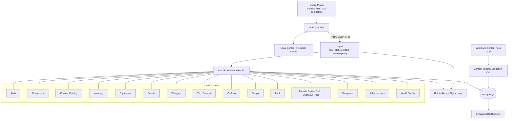
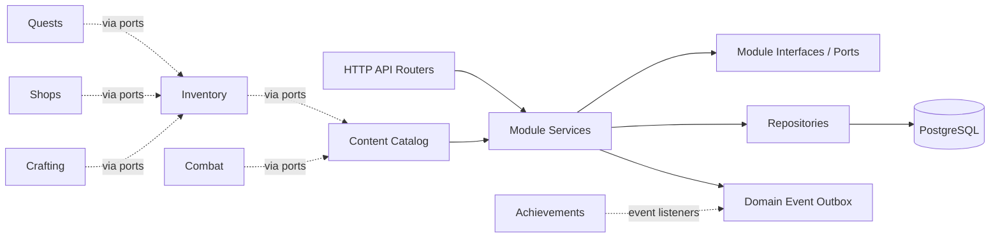
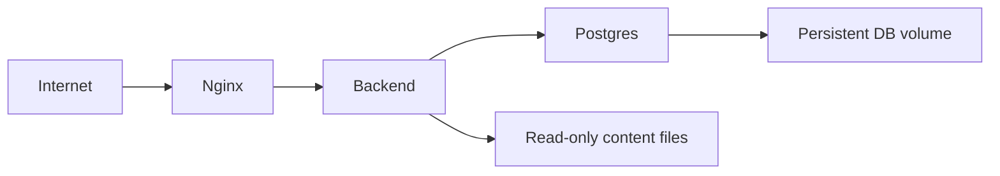

# Mobile-First Online 3D Fantasy RPG Architecture

This document defines a complete, original, mobile-first online 3D fantasy RPG architecture for Godot 4.x and a low-cost FastAPI/PostgreSQL backend. The design is intentionally modular, data-driven, and replaceable so a solo developer can operate the MVP on a single small VPS while preserving a path to scale later.

The game universe, systems, content names, factions, races, creatures, locations, story, and progression ideas below are original to this project. They are inspired only by broadly appealing qualities of classic online fantasy RPGs: approachable progression, exploration, social play, accessibility, and turn-based strategic combat.

> **5-year survival note:** The initial architecture is intentionally broad. The stricter corrective rules in [Brutal Architecture Review: 5-Year Solo Developer Survival](brutal_architecture_review.md) supersede this document anywhere there is tension. In particular, the MVP should be treated as a narrow vertical slice, not a commitment to ship every eventual social/economy/dungeon system at once.

## 1. Executive architecture overview

### Product concept

**Working title:** _Veilbound Tides_

_Veilbound Tides_ is a mobile-first online 3D fantasy RPG set in the original world of **Auralis**, a chain of floating reef-continents drifting above a luminous storm-sea called the **Glimmerdeep**. Players are **Wayfarers**, explorers marked by harmless crystalline echoes known as **Veilmarks**, who travel between sky-islands, help settlements, form parties, craft gear, collect mounts, trade, and fight tactical turn-based battles against original creatures born from unstable elemental weather.

### Architectural intent

The architecture is a **modular monolith backend** plus a **thin, data-driven Godot client**:

- One FastAPI service for low operational cost.
- PostgreSQL as the only required stateful service.
- Nginx as TLS reverse proxy and static file gateway.
- Docker Compose for repeatable self-hosted deployment.
- Content authored as JSON/YAML-like data files, validated and imported into PostgreSQL.
- Gameplay modules communicate through explicit service interfaces and event records.
- Client pulls versioned content manifests and runtime state from APIs.
- Real-time features are deliberately limited to chat and light presence; combat is request/response turn resolution for low server load.

### Core principles

1. **Data over code:** gameplay content lives in files or database rows.
2. **Replaceable modules:** each major system owns its data and exposes interfaces.
3. **Low server pressure:** asynchronous HTTP, short transactions, no expensive real-time simulation loop.
4. **Mobile first:** small payloads, cached content, turn-based interactions, low-frequency sync.
5. **Operational simplicity:** one VPS, Docker Compose, backups, logs, and migrations.
6. **Future scale without rewrite:** module boundaries permit later extraction into services if needed.

### MVP backend shape

FastAPI application modules:

- `auth`
- `accounts`
- `characters`
- `content`
- `inventory`
- `equipment`
- `quests`
- `dialogue`
- `combat`
- `crafting`
- `shops`
- `loot`
- `social`
- `mail`
- `guilds`
- `dungeons`
- `world_events`
- `achievements`

Modules live in one deployable process but are treated as independently replaceable packages. Cross-module calls use protocols/interfaces, not direct table manipulation.

### MVP client shape

Godot 4.x project layers:

- **Network layer:** authenticated API client, retries, offline-safe request queue.
- **Content layer:** manifest download, local cache, schema version checks.
- **Gameplay layer:** small module clients for inventory, quests, combat, social, etc.
- **Presentation layer:** mobile UI, 3D scenes, touch navigation, low-poly assets.
- **State layer:** local session cache; authoritative state remains server-side.

## 2. High-level system diagram



### Dependency direction



No module may reach into another module's tables directly. If a quest needs to grant an item, the quest service calls an inventory port. If the combat system needs spell data, it reads from the content catalog interface.

## 3. Folder structure

```text
/
├── README.md
├── docs/
│   └── architecture/
│       └── mobile_first_online_rpg_architecture.md
├── backend/
│   ├── app/
│   │   ├── main.py
│   │   ├── api/
│   │   │   └── router.py
│   │   ├── core/
│   │   │   ├── config.py
│   │   │   ├── security.py
│   │   │   └── events.py
│   │   ├── db/
│   │   │   ├── base.py
│   │   │   ├── session.py
│   │   │   └── models.py
│   │   └── modules/
│   │       ├── auth/
│   │       ├── characters/
│   │       ├── content/
│   │       ├── inventory/
│   │       ├── quests/
│   │       ├── combat/
│   │       └── social/
│   ├── tests/
│   ├── Dockerfile
│   ├── requirements.txt
│   └── pyproject.toml
├── content/
│   ├── spells/
│   ├── quests/
│   ├── enemies/
│   ├── npcs/
│   ├── items/
│   ├── equipment/
│   ├── loot_tables/
│   ├── gathering/
│   ├── shops/
│   ├── dialogue/
│   ├── achievements/
│   ├── crafting/
│   ├── mounts/
│   ├── dungeons/
│   └── zones/
├── godot_project/
│   ├── project.godot
│   ├── autoload/
│   ├── scenes/
│   └── scripts/
│       ├── modules/
│       ├── net/
│       └── ui/
└── infra/
    ├── docker-compose.yml
    ├── .env.example
    └── nginx/
        └── default.conf
```

### Folder rules

- `content/` contains author-authored gameplay data, not executable logic.
- `backend/app/modules/*` contains module-local services, schemas, ports, and repositories.
- `backend/app/core/*` contains shared infrastructure only: config, security primitives, event bus contracts.
- `backend/app/db/*` contains database setup and shared ORM models for the MVP. As modules mature, table definitions can move into module folders.
- `godot_project/scripts/modules/*` mirrors backend module names on the client.
- `infra/` contains deployment files only.

## 4. Module breakdown

### Shared module contract

Every gameplay module should expose:

- `router`: HTTP endpoints.
- `service`: business use cases.
- `repository`: persistence access for owned tables.
- `schemas`: request/response DTOs.
- `ports`: interfaces it depends on from other modules.
- `events`: domain events it emits or consumes.

Modules must not:

- Import another module's repository.
- Update another module's tables directly.
- Parse another module's content definitions privately.
- Hardcode gameplay identifiers beyond tests and sample data.

### Content catalog

**Purpose:** Store and validate all data-driven definitions.

**Owns:**

- Spells
- Quests
- Enemies
- NPCs
- Shops
- Loot tables
- Equipment templates
- Mount templates
- Dialogue graphs
- Achievements
- Crafting recipes
- Dungeons
- Zones
- World event templates

**Interfaces:**

- `get_definition(type, key, version)`
- `list_definitions(type, filters)`
- `validate_definition(type, payload)`
- `active_manifest(platform, build_version)`

**Dependencies:** database, content validation library.

### Authentication and accounts

**Purpose:** Account creation, login, JWT issuance, refresh, device sessions.

**Owns:**

- Accounts
- Credentials
- Refresh tokens
- Session revocation
- Optional parental/privacy flags later

**Interfaces:**

- `authenticate(email, password)`
- `issue_tokens(account_id)`
- `current_account(token)`
- `revoke_session(session_id)`

**Dependencies:** security utilities, accounts repository.

### Character progression

**Purpose:** Player characters, level, attributes, skill tracks, race/background selection.

**Owns:**

- Character profile
- Progression currencies
- Attribute allocation
- Unlock flags

**Interfaces:**

- `create_character(account_id, template_data)`
- `get_character(account_id, character_id)`
- `grant_progress(character_id, source, amount)`
- `apply_level_rewards(character_id, content_key)`

**Dependencies:** content catalog for progression tables.

### Inventory

**Purpose:** Durable item ownership, stack management, currency balances.

**Owns:**

- Inventory slots
- Item instances
- Stack quantities
- Wallet balances

**Interfaces:**

- `grant_item(character_id, item_key, quantity, source)`
- `consume_item(character_id, item_key, quantity, reason)`
- `move_item(character_id, from_slot, to_slot)`
- `get_inventory(character_id)`

**Dependencies:** content catalog for item definitions.

### Equipment

**Purpose:** Equipped gear, stat modifiers, loadout validation.

**Owns:**

- Equipped item references
- Loadouts
- Derived stat snapshots

**Interfaces:**

- `equip(character_id, item_instance_id, slot)`
- `unequip(character_id, slot)`
- `get_loadout(character_id)`
- `calculate_modifiers(character_id)`

**Dependencies:** inventory port, content catalog.

### Questing

**Purpose:** Quest state machines driven by content definitions.

**Owns:**

- Accepted quests
- Objective progress
- Completion and reward status

**Interfaces:**

- `accept_quest(character_id, quest_key)`
- `record_progress(character_id, event)`
- `complete_quest(character_id, quest_key)`
- `list_available_quests(character_id, zone_key)`

**Dependencies:** content catalog, inventory reward port, achievement event publisher.

### Dialogue

**Purpose:** NPC conversations and branching dialogue graphs.

**Owns:**

- Dialogue sessions
- Seen dialogue flags
- Choice outcomes

**Interfaces:**

- `start_dialogue(character_id, npc_key)`
- `choose_dialogue_option(session_id, option_key)`
- `resolve_dialogue_effects(session_id)`

**Dependencies:** content catalog, quest port, shop port.

### Combat and spells

**Purpose:** Server-authoritative turn-based encounter resolution.

**Owns:**

- Combat sessions
- Participants
- Turn order
- Action log
- Rewards pending claim

**Interfaces:**

- `start_encounter(character_id or party_id, encounter_key)`
- `submit_action(session_id, actor_id, action_payload)`
- `resolve_turn(session_id)`
- `finish_encounter(session_id)`

**Dependencies:** content catalog for spells/enemies/encounters, character stats port, inventory reward port, loot port.

**Replaceability:** Combat is isolated behind `CombatService`. A future real-time or grid-tactical system can replace it if it continues to accept encounter definitions and emit reward/progress events.

### Crafting and gathering

**Purpose:** Resource acquisition and recipe-based item creation.

**Owns:**

- Gathering node cooldowns per character
- Crafting job records
- Recipe progress if time-gated recipes are introduced

**Interfaces:**

- `gather(character_id, node_key)`
- `craft(character_id, recipe_key, quantity)`
- `list_known_recipes(character_id)`

**Dependencies:** content catalog, inventory port.

### Mounts

**Purpose:** Collectible traversal companions and movement modifiers.

**Owns:**

- Mount ownership
- Active mount
- Cosmetic and progression flags

**Interfaces:**

- `grant_mount(character_id, mount_key)`
- `activate_mount(character_id, mount_key)`
- `list_mounts(character_id)`

**Dependencies:** content catalog, character location rules.

### Shops

**Purpose:** NPC and faction shops defined by data.

**Owns:**

- Purchase transactions
- Rotating stock state
- Buyback entries if implemented

**Interfaces:**

- `get_shop(shop_key, character_id)`
- `buy(character_id, shop_key, listing_key, quantity)`
- `sell(character_id, item_instance_id, shop_key)`

**Dependencies:** content catalog, inventory port, faction/reputation port later.

### Loot

**Purpose:** Weighted reward generation from data-defined tables.

**Owns:**

- Loot roll audit records
- Pending loot claims

**Interfaces:**

- `roll(loot_table_key, context)`
- `grant_pending_loot(character_id, loot_roll_id)`

**Dependencies:** content catalog, inventory port.

### Achievements

**Purpose:** Data-driven achievement triggers and reward grants.

**Owns:**

- Achievement progress
- Claimed achievement rewards

**Interfaces:**

- `record_event(character_id, event)`
- `evaluate(character_id, achievement_key)`
- `claim_reward(character_id, achievement_key)`

**Dependencies:** event outbox, content catalog, inventory port.

### Dungeons

**Purpose:** Instanced multi-encounter adventures for solo or party play.

**Owns:**

- Dungeon run state
- Room/encounter progress
- Lockout/cooldown records if needed

**Interfaces:**

- `start_run(character_id or party_id, dungeon_key)`
- `advance_room(run_id, choice_key)`
- `abandon_run(run_id)`
- `complete_run(run_id)`

**Dependencies:** content catalog, combat port, loot port.

### Social features

**Purpose:** Friends, parties, guilds, chat, trading, and mail.

**Owns:**

- Friend relationships
- Party membership
- Guild membership and roles
- Chat channels and messages
- Trade sessions
- Mail messages and attachments

**Interfaces:**

- `send_friend_request`
- `create_party`
- `invite_to_party`
- `create_guild`
- `send_chat_message`
- `start_trade`
- `send_mail`

**Dependencies:** character identity port, inventory port for trade/mail attachments.

### World events

**Purpose:** Time-bounded server events generated from templates.

**Owns:**

- Active event windows
- Participation counters
- Event reward claims

**Interfaces:**

- `activate_event(event_key, starts_at, ends_at)`
- `record_participation(character_id, event_key, contribution)`
- `claim_event_reward(character_id, event_key)`

**Dependencies:** content catalog, quest/combat/loot ports.

## 5. Database schema

The schema is designed for PostgreSQL and a modular monolith. It uses UUID primary keys for account/player state and stable text keys for content definitions. Content definitions can be stored as `jsonb` so new data fields can be added without immediate table migrations, while indexed metadata supports filtering.

### Conventions

- `id uuid primary key` for mutable runtime entities.
- `key text` for stable content identifiers, e.g. `spell_glimmer_spark`.
- `content_version integer` for versioned definitions.
- `created_at timestamptz not null default now()`.
- `updated_at timestamptz not null default now()`.
- `deleted_at timestamptz` for soft deletion where player-visible records need auditability.
- `metadata jsonb not null default '{}'::jsonb`.
- Foreign keys use `on delete restrict` for durable history unless explicitly safe to cascade.

### Core identity

```sql
create table accounts (
    id uuid primary key,
    email text not null unique,
    display_name text not null unique,
    password_hash text not null,
    status text not null default 'active',
    created_at timestamptz not null default now(),
    updated_at timestamptz not null default now()
);

create table auth_refresh_tokens (
    id uuid primary key,
    account_id uuid not null references accounts(id),
    token_hash text not null unique,
    expires_at timestamptz not null,
    revoked_at timestamptz,
    created_at timestamptz not null default now()
);

create table characters (
    id uuid primary key,
    account_id uuid not null references accounts(id),
    name text not null unique,
    ancestry_key text not null,
    origin_key text not null,
    level integer not null default 1,
    experience bigint not null default 0,
    current_zone_key text,
    position jsonb not null default '{}'::jsonb,
    stats jsonb not null default '{}'::jsonb,
    flags jsonb not null default '{}'::jsonb,
    created_at timestamptz not null default now(),
    updated_at timestamptz not null default now()
);
```

### Content catalog

```sql
create table content_definitions (
    id uuid primary key,
    type text not null,
    key text not null,
    version integer not null,
    locale text not null default 'en',
    status text not null default 'draft',
    checksum text not null,
    definition jsonb not null,
    created_at timestamptz not null default now(),
    updated_at timestamptz not null default now(),
    unique (type, key, version, locale)
);

create index idx_content_definitions_lookup
    on content_definitions(type, key, status, version desc);

create table content_manifests (
    id uuid primary key,
    platform text not null,
    app_version text not null,
    manifest_version integer not null,
    checksum text not null,
    entries jsonb not null,
    published_at timestamptz,
    created_at timestamptz not null default now(),
    unique (platform, app_version, manifest_version)
);
```

### Inventory, equipment, currency

```sql
create table character_wallets (
    character_id uuid not null references characters(id),
    currency_key text not null,
    amount bigint not null default 0,
    updated_at timestamptz not null default now(),
    primary key (character_id, currency_key)
);

create table item_instances (
    id uuid primary key,
    character_id uuid not null references characters(id),
    item_key text not null,
    quantity integer not null default 1,
    durability integer,
    bound_state text not null default 'unbound',
    instance_data jsonb not null default '{}'::jsonb,
    created_at timestamptz not null default now(),
    updated_at timestamptz not null default now()
);

create table inventory_slots (
    character_id uuid not null references characters(id),
    bag_key text not null,
    slot_index integer not null,
    item_instance_id uuid references item_instances(id),
    primary key (character_id, bag_key, slot_index)
);

create table equipment_slots (
    character_id uuid not null references characters(id),
    slot_key text not null,
    item_instance_id uuid references item_instances(id),
    updated_at timestamptz not null default now(),
    primary key (character_id, slot_key)
);
```

### Quests, dialogue, achievements

```sql
create table character_quests (
    character_id uuid not null references characters(id),
    quest_key text not null,
    state text not null,
    objective_state jsonb not null default '{}'::jsonb,
    accepted_at timestamptz not null default now(),
    completed_at timestamptz,
    primary key (character_id, quest_key)
);

create table dialogue_sessions (
    id uuid primary key,
    character_id uuid not null references characters(id),
    npc_key text not null,
    dialogue_key text not null,
    node_key text not null,
    state jsonb not null default '{}'::jsonb,
    created_at timestamptz not null default now(),
    updated_at timestamptz not null default now()
);

create table character_achievements (
    character_id uuid not null references characters(id),
    achievement_key text not null,
    progress jsonb not null default '{}'::jsonb,
    completed_at timestamptz,
    reward_claimed_at timestamptz,
    primary key (character_id, achievement_key)
);
```

### Combat, loot, dungeons

```sql
create table combat_sessions (
    id uuid primary key,
    owner_character_id uuid references characters(id),
    party_id uuid,
    encounter_key text not null,
    state text not null,
    round_number integer not null default 1,
    participants jsonb not null,
    action_log jsonb not null default '[]'::jsonb,
    rewards jsonb not null default '{}'::jsonb,
    created_at timestamptz not null default now(),
    updated_at timestamptz not null default now()
);

create table loot_rolls (
    id uuid primary key,
    character_id uuid references characters(id),
    loot_table_key text not null,
    context jsonb not null default '{}'::jsonb,
    result jsonb not null,
    claimed_at timestamptz,
    created_at timestamptz not null default now()
);

create table dungeon_runs (
    id uuid primary key,
    dungeon_key text not null,
    owner_character_id uuid references characters(id),
    party_id uuid,
    state text not null,
    room_state jsonb not null default '{}'::jsonb,
    started_at timestamptz not null default now(),
    completed_at timestamptz
);
```

### Crafting, gathering, mounts, shops

```sql
create table gathering_cooldowns (
    character_id uuid not null references characters(id),
    node_key text not null,
    available_at timestamptz not null,
    primary key (character_id, node_key)
);

create table crafting_jobs (
    id uuid primary key,
    character_id uuid not null references characters(id),
    recipe_key text not null,
    quantity integer not null,
    state text not null,
    started_at timestamptz not null default now(),
    completed_at timestamptz
);

create table character_mounts (
    character_id uuid not null references characters(id),
    mount_key text not null,
    state jsonb not null default '{}'::jsonb,
    acquired_at timestamptz not null default now(),
    primary key (character_id, mount_key)
);

create table shop_transactions (
    id uuid primary key,
    character_id uuid not null references characters(id),
    shop_key text not null,
    listing_key text not null,
    transaction_type text not null,
    quantity integer not null,
    totals jsonb not null,
    created_at timestamptz not null default now()
);
```

### Social systems

```sql
create table friendships (
    requester_character_id uuid not null references characters(id),
    addressee_character_id uuid not null references characters(id),
    state text not null,
    created_at timestamptz not null default now(),
    updated_at timestamptz not null default now(),
    primary key (requester_character_id, addressee_character_id)
);

create table parties (
    id uuid primary key,
    leader_character_id uuid not null references characters(id),
    state text not null default 'active',
    created_at timestamptz not null default now()
);

create table party_members (
    party_id uuid not null references parties(id),
    character_id uuid not null references characters(id),
    role text not null default 'member',
    joined_at timestamptz not null default now(),
    primary key (party_id, character_id)
);

create table guilds (
    id uuid primary key,
    name text not null unique,
    tag text not null unique,
    description text not null default '',
    created_by_character_id uuid not null references characters(id),
    created_at timestamptz not null default now()
);

create table guild_members (
    guild_id uuid not null references guilds(id),
    character_id uuid not null references characters(id),
    role text not null,
    joined_at timestamptz not null default now(),
    primary key (guild_id, character_id)
);

create table chat_messages (
    id uuid primary key,
    channel_type text not null,
    channel_id text not null,
    sender_character_id uuid references characters(id),
    body text not null,
    moderation_state text not null default 'visible',
    created_at timestamptz not null default now()
);

create index idx_chat_messages_channel_created
    on chat_messages(channel_type, channel_id, created_at desc);

create table trade_sessions (
    id uuid primary key,
    initiator_character_id uuid not null references characters(id),
    recipient_character_id uuid not null references characters(id),
    state text not null,
    initiator_offer jsonb not null default '{}'::jsonb,
    recipient_offer jsonb not null default '{}'::jsonb,
    created_at timestamptz not null default now(),
    updated_at timestamptz not null default now()
);

create table mail_messages (
    id uuid primary key,
    sender_character_id uuid references characters(id),
    recipient_character_id uuid not null references characters(id),
    subject text not null,
    body text not null,
    attachments jsonb not null default '[]'::jsonb,
    read_at timestamptz,
    claimed_at timestamptz,
    created_at timestamptz not null default now(),
    expires_at timestamptz
);
```

### Events and audit

```sql
create table domain_events (
    id uuid primary key,
    event_type text not null,
    aggregate_type text not null,
    aggregate_id text not null,
    payload jsonb not null,
    processed_at timestamptz,
    created_at timestamptz not null default now()
);

create table world_event_instances (
    id uuid primary key,
    event_key text not null,
    state text not null,
    starts_at timestamptz not null,
    ends_at timestamptz not null,
    progress jsonb not null default '{}'::jsonb,
    created_at timestamptz not null default now()
);

create table character_world_event_progress (
    character_id uuid not null references characters(id),
    world_event_instance_id uuid not null references world_event_instances(id),
    contribution jsonb not null default '{}'::jsonb,
    reward_claimed_at timestamptz,
    primary key (character_id, world_event_instance_id)
);
```

## 6. API specification

### API conventions

- Base path: `/api/v1`
- Payload format: JSON
- Authentication: `Authorization: Bearer <access_token>`
- Pagination: cursor-based for growing collections.
- Idempotency: client sends `Idempotency-Key` for purchases, trades, mail attachments, combat actions, crafting, and reward claims.
- Errors:

```json
{
  "error": {
    "code": "inventory.insufficient_quantity",
    "message": "Not enough items.",
    "details": {}
  }
}
```

### Health and metadata

- `GET /health`
  - Returns service status.
- `GET /api/v1/server-info`
  - Returns API version, minimum client version, content manifest version.

### Auth

- `POST /api/v1/auth/register`
  - Request: `email`, `display_name`, `password`
  - Response: account summary and JWT pair.
- `POST /api/v1/auth/login`
  - Request: `email`, `password`
  - Response: JWT pair.
- `POST /api/v1/auth/refresh`
  - Request: refresh token.
  - Response: new JWT pair.
- `POST /api/v1/auth/logout`
  - Revokes refresh token.

### Characters

- `GET /api/v1/characters`
- `POST /api/v1/characters`
- `GET /api/v1/characters/{character_id}`
- `PATCH /api/v1/characters/{character_id}/active-zone`
- `GET /api/v1/characters/{character_id}/progression`

### Content

- `GET /api/v1/content/manifest?platform=android&app_version=0.1.0`
- `GET /api/v1/content/{type}`
- `GET /api/v1/content/{type}/{key}`
- `POST /api/v1/admin/content/import`
  - Admin-only.
- `POST /api/v1/admin/content/validate`
  - Admin-only.

### Inventory and equipment

- `GET /api/v1/characters/{character_id}/inventory`
- `POST /api/v1/characters/{character_id}/inventory/move`
- `GET /api/v1/characters/{character_id}/wallet`
- `GET /api/v1/characters/{character_id}/equipment`
- `POST /api/v1/characters/{character_id}/equipment/equip`
- `POST /api/v1/characters/{character_id}/equipment/unequip`

### Quests and dialogue

- `GET /api/v1/characters/{character_id}/quests`
- `GET /api/v1/characters/{character_id}/quests/available?zone_key=...`
- `POST /api/v1/characters/{character_id}/quests/{quest_key}/accept`
- `POST /api/v1/characters/{character_id}/quests/{quest_key}/complete`
- `POST /api/v1/characters/{character_id}/dialogue/start`
- `POST /api/v1/dialogue/{session_id}/choose`

### Combat and spells

- `POST /api/v1/characters/{character_id}/combat/start`
- `GET /api/v1/combat/{session_id}`
- `POST /api/v1/combat/{session_id}/actions`
- `POST /api/v1/combat/{session_id}/resolve`
- `POST /api/v1/combat/{session_id}/claim-rewards`

### Crafting, gathering, mounts, shops, loot

- `GET /api/v1/characters/{character_id}/crafting/recipes`
- `POST /api/v1/characters/{character_id}/crafting/craft`
- `POST /api/v1/characters/{character_id}/gathering/gather`
- `GET /api/v1/characters/{character_id}/mounts`
- `POST /api/v1/characters/{character_id}/mounts/{mount_key}/activate`
- `GET /api/v1/shops/{shop_key}`
- `POST /api/v1/shops/{shop_key}/buy`
- `POST /api/v1/shops/{shop_key}/sell`

### Achievements, dungeons, world events

- `GET /api/v1/characters/{character_id}/achievements`
- `POST /api/v1/characters/{character_id}/achievements/{achievement_key}/claim`
- `POST /api/v1/characters/{character_id}/dungeons/start`
- `GET /api/v1/dungeons/runs/{run_id}`
- `POST /api/v1/dungeons/runs/{run_id}/advance`
- `GET /api/v1/world-events/active`
- `POST /api/v1/world-events/{instance_id}/claim`

### Social

- `GET /api/v1/characters/{character_id}/friends`
- `POST /api/v1/characters/{character_id}/friends/request`
- `POST /api/v1/characters/{character_id}/friends/respond`
- `POST /api/v1/parties`
- `POST /api/v1/parties/{party_id}/invite`
- `POST /api/v1/parties/{party_id}/leave`
- `POST /api/v1/guilds`
- `GET /api/v1/guilds/{guild_id}`
- `POST /api/v1/guilds/{guild_id}/invite`
- `GET /api/v1/chat/{channel_type}/{channel_id}/messages`
- `POST /api/v1/chat/{channel_type}/{channel_id}/messages`
- `POST /api/v1/trades`
- `POST /api/v1/trades/{trade_id}/offer`
- `POST /api/v1/trades/{trade_id}/confirm`
- `GET /api/v1/characters/{character_id}/mail`
- `POST /api/v1/characters/{character_id}/mail`
- `POST /api/v1/mail/{mail_id}/claim`

## 7. Backend architecture

### Runtime model

The backend is a single FastAPI process running under Uvicorn/Gunicorn workers. For the MVP, two workers are enough on a 2 vCPU VPS. PostgreSQL handles durable state. No Redis, queue broker, object storage, or hosted service is required for MVP.

### Application layers

1. **API routers**
   - Validate request shape.
   - Authenticate account/character access.
   - Call module services.
   - Return DTOs.
2. **Module services**
   - Own business rules.
   - Depend on ports/interfaces for cross-module behavior.
   - Use transactions for state transitions.
3. **Repositories**
   - Own SQL/ORM persistence.
   - Expose module-specific query methods.
4. **Content catalog**
   - Provides versioned definitions.
   - Shields services from raw file formats.
5. **Domain event outbox**
   - Records gameplay events.
   - Allows achievements, analytics, and world events to process later without tight coupling.

### Backend module independence

Example: quest completion flow.

1. Quest service loads quest definition from content catalog.
2. Quest service verifies objective state.
3. Quest service emits `quest.completed`.
4. Quest service calls inventory reward port for item/currency grants.
5. Achievement service later consumes `quest.completed`.

The quest service does not know inventory table structure, achievement schema, or dialogue internals.

### Data-driven gameplay execution

Gameplay definitions use generic effect and condition blocks:

```json
{
  "conditions": [
    {"type": "character_level_at_least", "value": 3}
  ],
  "effects": [
    {"type": "grant_item", "item_key": "item_sunthread_bandage", "quantity": 2},
    {"type": "grant_experience", "amount": 75}
  ]
}
```

Code implements reusable condition/effect handlers. Content composes those handlers.

### Background work without extra infrastructure

MVP background tasks:

- Content import validation.
- Expired token cleanup.
- Old chat pruning.
- Mail expiry.
- World event activation.

Run these through:

- FastAPI startup scheduler for light tasks, or
- Cron on the VPS calling management commands.

Avoid adding a queue until there is sustained background load or operational evidence.

### Observability

- Structured JSON logs to stdout.
- Nginx access/error logs with rotation.
- `/health` endpoint.
- Optional self-hosted uptime check later.
- PostgreSQL slow query log enabled for tuning.

## 8. Client architecture

### Godot project principles

- Android first, iOS compatible.
- Touch UI is the primary input.
- Avoid large always-loaded scenes.
- Prefer low-poly, stylized assets and baked lighting.
- Stream zone scenes additively where possible.
- Cache versioned content locally.
- Server remains authoritative for account, inventory, combat results, trades, mail, and progression.

### Client layers

```text
Godot Client
├── App bootstrap
├── Auth session
├── API client
├── Content cache
├── Character state cache
├── Module facades
│   ├── InventoryClient
│   ├── QuestClient
│   ├── CombatClient
│   ├── SocialClient
│   └── ShopClient
├── UI screens
└── 3D scenes
```

### Mobile UX

- One-thumb navigation for core menus.
- Tap-to-move or virtual joystick configurable by player.
- Turn-based combat uses large action buttons, clear target selection, and confirmation prompts.
- Short sessions supported by quick objectives, resumable combat sessions, and server-side save state.
- Text size, color contrast, reduced effects, and haptics toggles in settings.

### Client module independence

Client systems mirror backend module APIs:

- Inventory UI talks to `InventoryClient`.
- Quest UI talks to `QuestClient`.
- Combat UI talks to `CombatClient`.
- Content names, icons, stats, spell descriptions, dialogue text, and shop listings are read from cached content definitions.

The Godot client should not encode quest objective logic, item rules, or spell math beyond presentation previews.

### Asset strategy

For a solo developer:

- Use original low-poly modular environment kits.
- Keep creatures stylized and silhouette-driven.
- Reuse rig categories with original meshes/materials.
- Separate gameplay content keys from asset paths so assets can be replaced.
- Use texture atlases and compressed mobile texture formats.

## 9. Networking architecture

### Protocol choices

- HTTPS JSON REST for most gameplay.
- Optional WebSocket only for chat/presence after REST polling becomes insufficient.
- No authoritative real-time movement server in MVP.
- Zone presence is lightweight: periodic location/status updates.

### Request model

- Client authenticates and stores short-lived access token plus refresh token.
- Client downloads content manifest.
- Client caches unchanged content definitions by checksum.
- Client sends gameplay actions as discrete commands.
- Server validates and returns authoritative state deltas.

### Combat networking

Turn-based combat avoids a high-frequency real-time channel:

1. Client starts encounter.
2. Server returns participants, available actions, turn state.
3. Client submits selected action.
4. Server records action and resolves when rules allow.
5. Client polls or receives a lightweight notification.

This keeps CPU, bandwidth, and synchronization complexity low.

### Social networking

MVP chat can use polling:

- `GET /messages?after=<message_id>` every few seconds while chat is open.
- Rate limit `POST /messages`.
- Store limited history.

Later upgrade path:

- Add WebSocket gateway inside same FastAPI app.
- Keep chat service interface unchanged.
- Client `ChatClient` swaps transport implementation.

### Offline and unreliable mobile networks

- Read-only content works offline after first download.
- Mutating commands require server confirmation.
- Idempotency keys prevent duplicate purchases/rewards after retry.
- UI shows pending state for slow requests.
- Client never assumes rewards until server confirms.

## 10. Save system architecture

### Authority model

The server is authoritative for:

- Account and character identity.
- Inventory, equipment, wallets.
- Quest progress.
- Combat state.
- Achievements.
- Social records.
- Trades and mail.
- Dungeon runs.
- World event participation.

The client may cache:

- Content definitions.
- Last known character state.
- UI preferences.
- Non-authoritative scene position hints.
- Pending request metadata.

### Save boundaries

Each module owns its save records. There is no single giant character save blob. Character state is assembled through module queries when needed.

### Transactional safety

Use database transactions for:

- Purchases.
- Crafting.
- Quest completion rewards.
- Combat reward claims.
- Trades.
- Mail attachment claims.

Use optimistic concurrency or row locks for:

- Item instances in trades.
- Wallet balances.
- Combat sessions.
- Inventory slots.

### Backups

- Nightly `pg_dump` compressed backup on VPS.
- Keep rolling local backups and optionally sync encrypted archives to low-cost storage later.
- Test restore process regularly.
- Content files remain in Git, so database backups focus on player state.

## 11. Content pipeline architecture

### Authoring format

Use JSON files for MVP because they are easy to validate with Python and consume in Godot if needed. YAML can be added later if authoring ergonomics require it.

Content file conventions:

```text
content/{type}/{key}.json
```

Each file includes:

- `type`
- `key`
- `version`
- `display`
- `rules`
- `assets`
- `tags`
- `localization`

### Content lifecycle

1. Author edits content file.
2. Local validation checks schema, references, and balance constraints.
3. Import CLI computes checksum.
4. Import CLI writes draft definitions to PostgreSQL.
5. Admin endpoint or CLI publishes definitions into a manifest.
6. Client downloads manifest and changed definitions.

### Validation types

- Schema validation: required fields, field types.
- Reference validation: item keys, spell keys, NPC keys, zone keys exist.
- Rule validation: effect/condition types are known.
- Economy validation: obvious invalid prices, negative rewards, impossible crafting inputs.
- Localization validation: display strings exist for supported locales.

### Example original content categories

- `ancestry`: Lumenfolk, Brindlekin, Orran, Tideveiled.
- `region`: Dawnreef, Murkmist Basin, Emberfen Spires.
- `faction`: Lantern Compact, Rootbound Circle, Glasswake Cartographers.
- `creature`: prismback grazer, fog-thorn lurker, embermote swarm.
- `spell`: glimmer spark, root snare, tide mend.
- `mount`: reedstrider, cloud-manta, pebblehorn.

These names are project-original examples and should remain editable through content files.

## 12. Security architecture

### Authentication

- Store passwords with Argon2id or bcrypt.
- Use short-lived JWT access tokens.
- Use refresh tokens stored as hashes in PostgreSQL.
- Revoke refresh tokens on logout or suspicious activity.
- Include token audience, issuer, expiry, and subject claims.

### Authorization

- Every character-scoped endpoint verifies account ownership.
- Admin content endpoints require admin role.
- Guild/party actions validate role permissions.
- Trade and mail attachment actions validate item ownership and lock state.

### Abuse prevention

- Rate limit login, registration, chat, mail, trade, and marketplace-like actions.
- Add message length limits and basic profanity/spam hooks.
- Use idempotency keys for reward-affecting endpoints.
- Audit high-value grants, trades, and admin content imports.

### Secrets

- Use `.env` files on VPS and Docker secrets later if needed.
- Never commit production secrets.
- Rotate JWT signing secret if leaked.
- Use separate development and production databases.

### Transport and infrastructure

- Nginx terminates TLS.
- Force HTTPS.
- Use secure headers.
- Restrict PostgreSQL port to Docker network/localhost.
- Keep admin endpoints behind auth and optionally IP allowlisting.

## 13. Docker deployment architecture

### MVP containers

- `nginx`: public entrypoint, TLS, reverse proxy.
- `backend`: FastAPI app.
- `postgres`: database.

### Docker Compose layout



### VPS sizing target

DigitalOcean VPS:

- 2 vCPU
- 4GB RAM
- 80GB SSD

Expected MVP fit:

- PostgreSQL: 512MB-1GB practical memory envelope.
- Backend: 2 workers, modest memory use.
- Nginx: minimal.
- Content: small JSON payloads.
- Combat: request/response, no high-frequency simulation.

### Deployment flow

1. Build backend image.
2. Copy or mount content files.
3. Run migrations.
4. Import and publish content manifest.
5. Start containers.
6. Check `/health`.

### Low-cost operations

- Use one VPS during development/testing.
- Use local Docker Compose for development.
- Avoid managed databases until operational pain justifies them.
- Avoid separate queue/cache/search services for MVP.
- Keep logs on disk with rotation.

## 14. Development roadmap

### Phase 0: Foundation

- Repository structure.
- Docker Compose.
- FastAPI app skeleton.
- PostgreSQL connection and migrations.
- Content schema and validation CLI.
- Godot project skeleton.
- CI validation for Python and content JSON.

### Phase 1: Account and character loop

- Register/login/JWT refresh.
- Character creation.
- Content manifest download.
- Basic Godot login and character select screens.
- Server-authoritative character profile.

### Phase 2: Exploration and quest loop

- Zone definitions.
- NPC definitions.
- Dialogue graph definitions.
- Quest accept/progress/complete.
- Original starting region: Dawnreef.
- Mobile 3D movement prototype.

### Phase 3: Inventory, shops, crafting

- Item definitions.
- Inventory and wallet.
- Equipment slots.
- Data-driven shops.
- Gathering nodes and crafting recipes.

### Phase 4: Turn-based combat

- Enemy definitions.
- Spell/action definitions.
- Encounter definitions.
- Combat session persistence.
- Reward and loot table integration.
- Combat UI.

### Phase 5: Social MVP

- Friends.
- Parties.
- Guild basics.
- Chat polling.
- Mail.
- Safe direct trading.

### Phase 6: Dungeons, achievements, world events

- Instanced dungeon runs.
- Achievement event processing.
- Scheduled world event instances.
- Expanded content pipeline and balance tooling.

## 15. MVP scope

### Included

- Android-first Godot client with touch controls.
- Account registration/login.
- One character per account initially, with schema supporting more.
- One original ancestry set and three selectable origins.
- One starting region: **Dawnreef Atoll**.
- Two small adjacent zones.
- 8-12 NPCs through data.
- 10-15 quests through data.
- 15-25 items through data.
- 8-12 spells/actions through data.
- 8-12 enemy definitions through data.
- 3 shops through data.
- 5 crafting recipes through data.
- 3 gathering node types through data.
- 2 mounts through data.
- 1 small dungeon through data.
- Friends, parties, guild creation, chat polling, mail, and direct trade MVP.
- Basic achievements through event processing.

### Excluded from MVP

- Large open world.
- Real-time action combat.
- Player housing.
- Auction house.
- Complex PvP.
- Voice chat.
- Managed cloud services.
- Large-scale sharding.
- Advanced anti-cheat.

### Original MVP narrative

Dawnreef Atoll is dimming because the **Lantern Wells** that stabilize nearby sky-reefs are filling with pale salt-crystal growth. The player joins local Wayfarers, helps the **Lantern Compact**, studies storm-touched creatures, and discovers that the Glimmerdeep is not hostile but reacting to abandoned machines left by the extinct **Vey Architects**, an original precursor culture remembered only through fractured civic records and living stone instruments.

### Original playable peoples

- **Lumenfolk:** warm-skinned people with faint bioluminescent freckles; known for navigation and glasscraft.
- **Brindlekin:** fur-patterned, upright folk with keen hearing and strong oral histories.
- **Orran:** broad-handed cliff dwellers with mineral-like hair textures and patient engineering traditions.
- **Tideveiled:** amphibious-featured islanders adapted to mist, rain, and tidal caves.

These are original descriptions and should be refined by art direction into distinctive, non-derivative designs.

## 16. Expansion roadmap

### Content expansion

- Add regions through data: Murkmist Basin, Emberfen Spires, Glasswake Shoals.
- Add dungeon templates with branching rooms and rotating modifiers.
- Add world event seasons using existing event definitions.
- Add new spell schools through content effect handlers.
- Add new crafting professions by extending recipe categories.

### Systems expansion

- WebSocket chat/presence transport behind the existing social interface.
- Guild ranks, guild goals, and cooperative guild projects.
- Faction reputation module.
- Marketplace or consignment system only after trade/mail security is mature.
- Optional PvP duel mode using combat service replacement or extension.
- Content moderation tools for chat and display names.

### Scale expansion

- Add PgBouncer if connection pressure appears.
- Add Redis only if measurable cache/session/queue pressure justifies it.
- Split static content delivery from API if download traffic grows.
- Extract chat or combat into separate services only after module metrics show sustained pressure.
- Add read replicas only after database reads exceed single-node tuning.

## Pre-implementation risk review

This risk review is intentionally placed before implementation scaffolding.

### Architectural weaknesses

1. **JSONB content flexibility can hide invalid content.**
   - Solution: enforce strict content schemas, reference validation, and CI checks before import.
2. **A modular monolith can decay into direct cross-module imports.**
   - Solution: define module ports and code review rules; tests should exercise modules through public services.
3. **Generic effect systems can become unmaintainable if effect handlers are too broad.**
   - Solution: keep effect handlers small, named, versioned, and documented; reject arbitrary scripting in MVP.
4. **Social features create moderation and abuse surface.**
   - Solution: rate limits, reporting hooks, message retention limits, and admin audit logs from the start.
5. **Trade/mail attachments risk item duplication bugs.**
   - Solution: use transactions, row locks, idempotency keys, and item lock states.

### Scalability risks

1. **Polling chat may become inefficient.**
   - Solution: keep chat transport behind an interface and upgrade to WebSocket when active users justify it.
2. **PostgreSQL connections may exhaust memory.**
   - Solution: conservative worker count, SQLAlchemy pooling limits, PgBouncer later.
3. **Content manifest downloads may spike after updates.**
   - Solution: checksums, compressed responses, static Nginx content serving, and platform-specific manifests.
4. **Combat sessions stored as large JSON logs may grow.**
   - Solution: cap encounter length, archive logs, and split action rows later if required.

### Maintenance risks

1. **Too many systems for a solo developer.**
   - Solution: ship narrow vertical slices; keep MVP content small; use repeated generic patterns.
2. **Balancing content manually becomes slow.**
   - Solution: content linting, spreadsheet export/import later, and simple balance reports.
3. **Godot and backend definitions may drift.**
   - Solution: client consumes server content manifests; avoid duplicated client constants.

### Performance risks

1. **Mobile 3D scenes can exceed device budgets.**
   - Solution: low-poly style, baked lighting, occlusion, LODs, texture atlases, small zones.
2. **Large inventory/quest payloads can slow mobile UI.**
   - Solution: paginated APIs, state deltas, and local cache.
3. **Unindexed JSON queries can slow content lookups.**
   - Solution: index common metadata and use stable columns for `type`, `key`, `status`, `version`.

### Future bottlenecks

1. **Single VPS limits concurrent active users.**
   - Solution: design stateless API workers, externalize config, and keep module boundaries clean for later horizontal scaling.
2. **Manual deployment may become risky.**
   - Solution: Docker Compose now, scripted backup/restore, and CI/CD later.
3. **Admin content tooling may lag behind content volume.**
   - Solution: start with CLI validation, then add a small admin UI after schemas stabilize.

## 17. Implementation kickoff

The initial implementation should be a thin foundation, not a full game. It should establish:

1. FastAPI app skeleton with health and version endpoints.
2. Content definition loader and validation primitives.
3. Example original content files for every required content category.
4. PostgreSQL-ready Docker Compose and Nginx reverse proxy.
5. Godot project skeleton with API and content-cache scripts.
6. Tests that validate content file structure and key uniqueness.

The implementation must continue to respect the planning above: no hardcoded gameplay behavior in system code, no giant manager class, and every major system represented by replaceable module boundaries.
